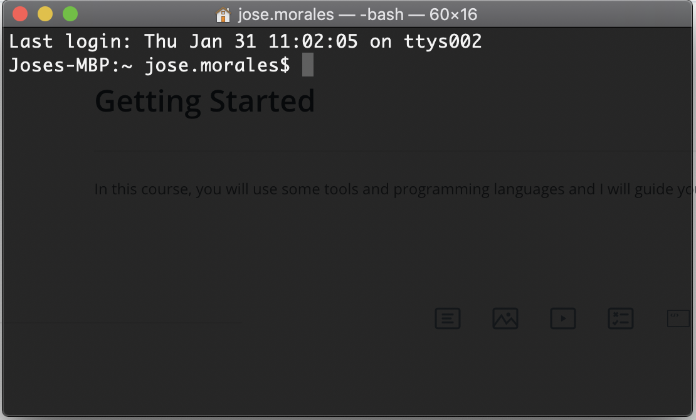
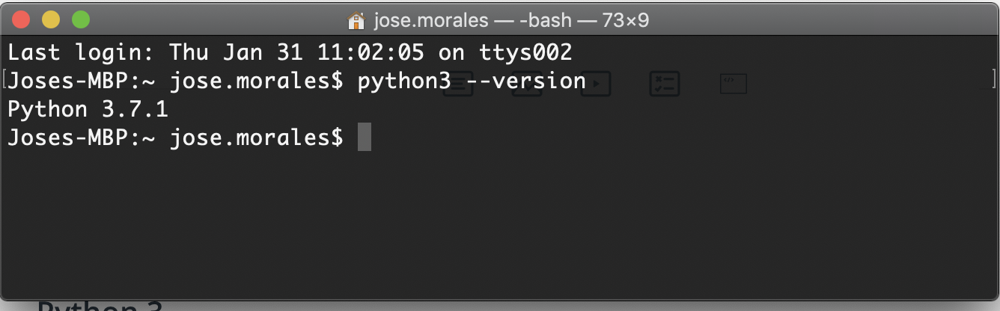
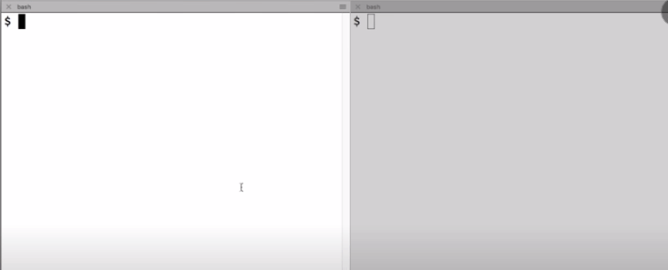
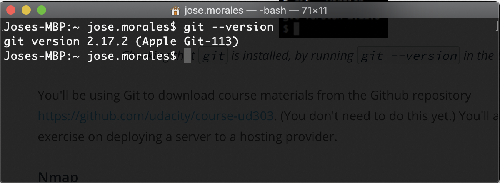
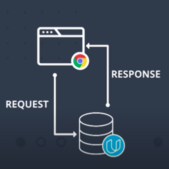
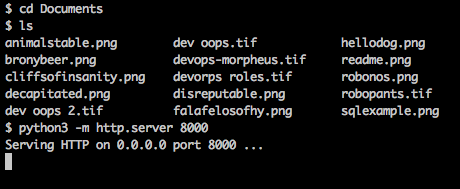
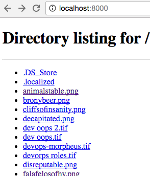

# HTTP & Web Servers

This course is intended for budding full-stack web developers to master the basics of HTTP, the protocol that underlies all web technology.

In this course, you'll explore HTTP directly, talking with web servers and browsers by hand. You'll write and deploy low-level web applications in Python. And you'll learn more about how HTTP connects with other web technologies.

- [HTTP & Web Servers](#http--web-servers)
  - [Requests & Responses](#requests--responses)
    - [Introduction](#introduction)
    - [Getting Started](#getting-started)
    - [Your first Web Server](#your-first-web-server)
    - [Parts of a URI](#parts-of-a-uri)

## Requests & Responses

In this lesson, you will examine HTTP requests and responses by experimenting directly with a web server, interacting with it by hand.

### Introduction

HTTP, the Hypertext Transfer Protocol, is the language that web browsers and web server speaks to each other. Every time you open a web page, or download a file, or watch a video, it's HTTP that makes it possible.

**Learning Objectives**:

- Practice with some of the software tools you will need to use to become a Web Developer.
- Define the HTTP protocol.
- Analyze the parts of URI
- Describe the behavior of the GET Requests
- Describe the behavior of the HTTP Responses.

### Getting Started

In this course, you will use some tools and programming languages and I will guide you to be ready.

Shell terminal
You'll be using the command line a lot in this course. A lot of the instructions in this course will ask you to run commands on the terminal on your computer.



- In `Windows OS`, you can use the `Git Bash terminal` program from [Git][1].
- On `Windows 10 OS`, you can use the `bash shell` in [Windows Subsystem][2] for Linux.
- On `Mac OS`, you can use the `built-in Terminal` program, or another such as `iTerm`.
- On `Linux`, you can use any common terminal program such as `gnome-terminal` or `xterm`.

**Python 3**:

For this course, you will need to install locally in your computer Python 3.



- `Windows and Mac`: Install it from python.org: <https://www.python.org/downloads/>
- `Mac (with Homebrew)`: In the terminal, run `brew install python3`
- `Debian/Ubuntu/Mint`: In the terminal, run `sudo apt-get install python3`

`Note`: In MAC OS Python 2 is pre-installed in your computer and it is possible that running `python --version` will show the version 2 of the language. In this case, use the command `python3 --version`.

You should be ready to run Python code directly in your Interactive interpreter in your terminal:


**Nmap Network testing tooling**:

You'll also need to install `ncat`, which is part of the `Nmap` network testing toolkit. We'll be using `ncat` to investigate how `web servers and browsers talk to each other`.

- `Windows`: Download and run <https://nmap.org/dist/nmap-7.30-setup.exe>
- `Mac (with Homebrew)`: In the terminal, run `brew install nmap`
- `Mac (without Homebrew)`: Download and install <https://nmap.org/dist/nmap-7.30.dmg>
- `Debian/Ubuntu/Mint`: In the terminal, run `sudo apt-get install nmap`

To check whether `ncat` is installed and working, open up two terminals. In one of them, run `ncat -l 9999` then in the other, `ncat localhost 9999`. Then type something into each terminal and press Enter. You should see the message on the opposite terminal.

[Use ncat][3]



**Git**:

You will need to have the Git version control software installed. If you don't have it already, you can download it from <https://git-scm.com/downloads>.



Install and test your software!
Before going on, check that you have all the software installed for this course.

### Your first Web Server

In this lesson, we are going to write our first web server.



HTTP was originally created to serve hypertext documents, but today is used for much more. As a user of the web, you're using HTTP all the time.

`Quiz`: Which of these events are likely to cause an HTTP request to happen?

`Solution`: Applications that you use in a web browser, and mobile services, are both likely to use HTTP. But low-level network tests such as ping do not.

**Instructor Notes**:

Did the pizza one surprise you?

A lot of smartphone apps use `HTTP` under the hood to send `requests` and `receive` data. Web browsers are just the most common — and complicated — user interface for web technology.

But browsers are not the only web client around. HTTP is powerful and widely supported in software, so it's a common choice for programs that need to talk to each other across the network, even if they don't look anything like a web browser.

**Exercise: Running your first web server**:

So what about the other end, the web server?

Well, it turns out that a web server can actually be a lot simpler than a browser. Browsers have all this user interface and animation and graphics stuff going on. A server just needs to do one thing: handle incoming requests.

The Python `http.server` module, can run a built-in web server on your computer. It's not a web app you'd publish to the world; it's a demonstration of Python's HTTP abilities. We'll be referring to this as the demo server in this lesson.

`Note`: `http.server` is not recommended for `production`. It only implements `basic security checks`.

So, let's get started with the demo web server:

1) Open up a terminal.
2) `cd` into a directory that has some files in it (maybe a directory containing some text files, HTML files, or images ).
3) Run `python3 -m http.server 8000` in your terminal.

Here, I've run it in a directory containing some silly comics I drew:



When you start up the demo server, it will print a message telling you that it's serving HTTP. Leave it running, and leave the terminal open. Now try accessing <http://localhost:8000/> from your browser. You should see something like this, although the file names you see will be different from mine:



And that's the Python demo web server, running on your own computer. It serves up files on your local disk so you can look at them in your browser.

This may not seem like much of a big deal — after all, if you just wanted to access files on your local computer in your browser, you could use `file://` URIs. But the demo server is actually a web server. If you have another computer on the same local network, you could use it to access files served up by this server.

When you put `localhost:8000` in your browser, your browser sends an HTTP request to the Python program you're running. That program responds with a piece of data, which your browser presents to you. In this case, it's showing you a directory listing as a piece of HTML. Use your browser's developer tools to look at the HTML that it sends.

> _Note: If you have a file called index.html in that directory, you'll see the contents of that file in your browser instead of the directory listing. Move that file somewhere else and reload the page, and you will see the directory listing like the one above._

**Quiz**:

Keep the terminal with the Python web server running. What happens if you make up a web address that doesn't correspond to a file you actually have, like <http://localhost:8000/NotExistyFile> ?

_Which of these behaviors do you get?_

```text
That's what should happen, anyhow: You get a 404 error code. 404 is the famous HTTP code for "Not Found", meaning that the resource the client asked for isn't there.

404 is the HTTP status code for "Not Found". On Highway 101, not far from the Udacity office in Mountain View, there's a sign that tells the distance to Los Angeles. As it happens, it's 404 miles from Mountain View to Los Angeles, so the sign says Los Angeles 404. And so, every web programmer in Silicon Valley has probably heard the "Los Angeles Not Found" joke at least once.

For more information on the Http Status code check the [link][4]
```

**What's a server anyway?**:

A server is just a program that accepts connections from other programs on the network.

When you start a server program, it waits for clients to connect to it — like the demo server waiting for your web browser to ask it for a page. Then when a connection comes in, the server runs a piece of code — like calling a function — to handle each incoming connection. A connection in this sense is like a phone call: it's a channel through which the client and server can talk to each other. Web clients send requests over these connections, and servers send responses back.

Take a look in the terminal where you ran the demo server. You'll see a server log with an entry for each request your browser sent:

```sh
Serving HTTP on 0.0.0.0 port 8000 ...
127.0.0.1 - - [03/Oct/2016 13:47:35] "GET / HTTP/1.1" 200 -
127.0.0.1 - - [03/Oct/2016 13:47:36] "GET / HTTP/1.1" 200 -
127.0.0.1 - - [03/Oct/2016 13:48:06] "GET /falafelosofhy.png HTTP/1.1" 200 -
127.0.0.1 - - [03/Oct/2016 13:49:23] code 404, message File not found
127.0.0.1 - - [03/Oct/2016 13:49:23] "GET /NotExistyFile HTTP/1.1" 404 -
```

Hey wow, what is all this stuff? There are some dates and times in there, but what's `GET / HTTP/1.1`, or for that matter `127.0.0.1`? And what's that `200` doing over there?

How do these things relate to the web address you put into your browser? Let's take a look at that next.

### Parts of a URI

mailto is used for links to email addresses. data is used to put a piece of hardcoded data directly into a web page, for instance a small image. magnet is used for links to some file-sharing services such as BitTorrent. However, there is no such thing as a postal URI; if you want to send postal mail from the Web you still need to print it out and put it in the mailbox yourself.

<!-- urls / paths -->
[1]: https://git-scm.com/download/win
[2]: https://docs.microsoft.com/en-us/windows/wsl/install-win10
[3]: https://youtu.be/qeQ6pKxUp-Q
[4]: https://www.w3.org/Protocols/rfc2616/rfc2616-sec10.html
