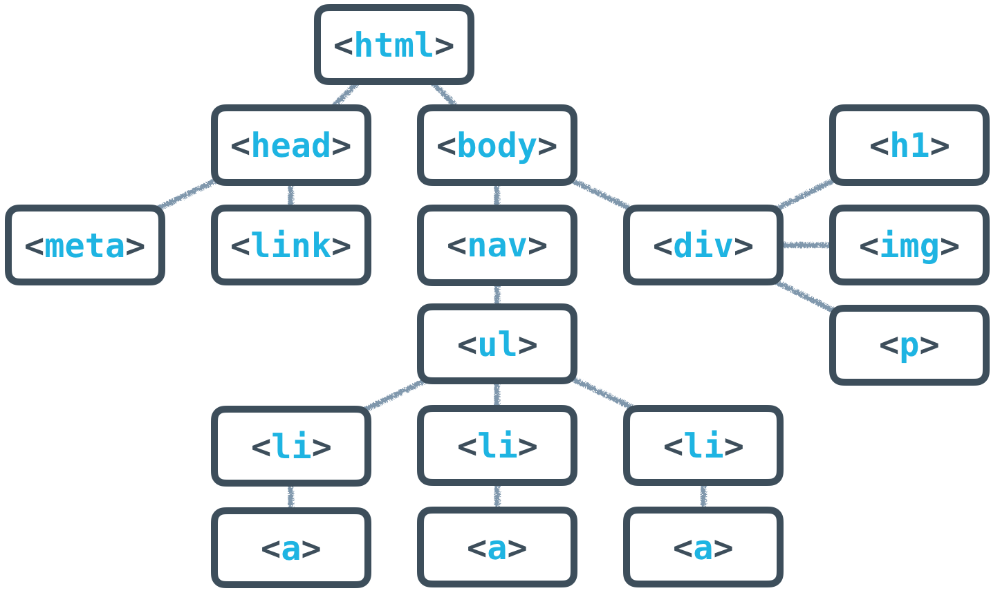
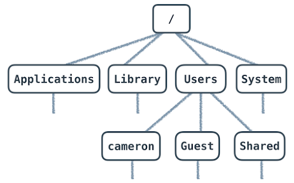
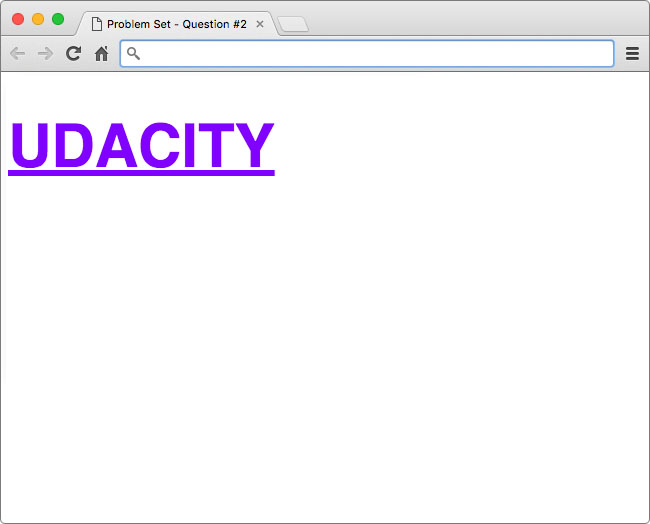

# Intro to HTML & CSS

- [Intro to HTML & CSS](#intro-to-html--css)
  - [Lesson 1](#lesson-1)
    - [Make your first element](#make-your-first-element)
    - [Text Editors](#text-editors)
    - [Browsers](#browsers)
    - [Trees](#trees)
    - [HTML and Trees](#html-and-trees)
    - [HTML Research](#html-research)
    - [HTML Structure Part 2](#html-structure-part-2)
    - [HTML Documents in Depth](#html-documents-in-depth)
  - [Lesson 2](#lesson-2)
    - [Make a button](#make-a-button)
    - [Make All the Headers](#make-all-the-headers)
    - [Make a list](#make-a-list)
    - [Tree to HTML](#tree-to-html)
    - [Hyperlinks](#hyperlinks)
    - [Add an Image](#add-an-image)
    - [Path](#path)
    - [Figures](#figures)
    - [Mockup Website](#mockup-website)
  - [Lesson 3](#lesson-3)
    - [CSS or HTML?](#css-or-html)
    - [CSS Rulesets](#css-rulesets)
    - [Comments](#comments)
    - [Tag Selectors](#tag-selectors)
    - [Attributes and Selectors](#attributes-and-selectors)
    - [Using Selectors](#using-selectors)
    - [Developer tools on different browsers](#developer-tools-on-different-browsers)
    - [CSS Units](#css-units)
    - [CSS Colors](#css-colors)
    - [Identifying Color](#identifying-color)
  - [Lesson 4](#lesson-4)
    - [Welcome to the CSS syntax problem set!](#welcome-to-the-css-syntax-problem-set)
    - [Style an Image](#style-an-image)
    - [Style the Font](#style-the-font)
    - [Using attributes](#using-attributes)

## Lesson 1

### Make your first element

To recap the previous video, your goal is to make three elements:

- One paragraph
- Two spans
Make sure you put some text content in every element!

Here's an example element:

```text
<tag>content</tag>
```

Feel free to use the workspace below to create your elements!

**Solution**:

```html
<p>I'm Cameron!</p>
<span>I like teaching</span>
<span>and web dev :)</span>
```

**Preview**:

```text
I'm Cameron!
I like teaching and web dev :)
```

**Note**: Paragraph in it's own line(paragraph has it own line) but both span tag made one line(span are the parts of the line).

### Text Editors

- Visual Studio Code
- Atom Editor
- Emacs
- VI/VIM [Learn how to use vim](https://www.openvim.com/)

### Browsers

- Google Chrome
- Mozilla Firefox

### Trees


### HTML and Trees


| Code                                       | Bug or Not with Description                                                                                                                            |
| :----------------------------------------- | :----------------------------------------------------------------------------------------------------------------------------------------------------- |
| `<p>a paragraph<p>`                        | Improperly formatted                                                                                                                                   |
| `<p><em>words, words, words.</em></p>`     | Looks Good                                                                                                                                             |
| `<span...middle of the sentence...</span>` | If you write this in a code editor, you'll notice different coloring on the tags. Syntax color is a clue that things are or aren't properly formatted! |
| `<p><em>words, words, words.</p></em>`     | The other element is the child of the `<p>` element, and as such, you have to close it inside the `<p>`, unlike what was done here.                    |

### HTML Research

Here is the [MDN HTML elements reference](https://developer.mozilla.org/en-US/docs/Web/HTML/Element) page. Once you're there, click on HTML elements on the left-hand sidebar. Then, search for **bold** and **emphasis** (remember, you can search text on a page using keyboard shortcuts `⌘ + F` for Mac, or `Ctrl + F` for Windows!).

**Solution**:

```html
<strong>This text should be bold.</strong>
<em>And this text should have emphasis (italics).</em>
```

**Preview**:

```text
This text should be bold. And this text should have emphasis (italics).
```

### HTML Structure Part 2

Congratulations! You created your first HTML elements, set up your development environment, streamlined your workflow, and even organized elements on a page using a standard HTML tree structure.

Now, let's take a moment for a little trip down memory lane. Remember this clip from the beginning of the lesson?


Did it seem odd that it took 10 lines of HTML to create a webpage that only displayed four words? At this point, you know that `<h1>This is a heading.</h1>` is responsible for displaying the heading on the page, but what about the rest of the code?


You can think of it as a template. And, following this template will help ensure that the page is displayed as the developer (you) intended. It not only says what should be displayed, but also includes relevant information that tells the browser how to display it.

This template can be broken down into 3 parts:

1. `DOCTYPE`: Describes the type of HTML. While there are technically different types, for 99.999% of the HTML you'll write, you’ll likely be fine with <!DOCTYPE html>.
1. `<head>`: Describes meta information about the site, such as the title, and provides links to scripts and stylesheets the site needs to render and behave correctly.
1. `<body>`: Describes the actual content of the site that users will see.
Omitting some of this information doesn't necessarily mean that the page won't be displayed. In fact, your browser will assume certain parts of the template exist even if you accidentally leave them out. Take this line of HTML for example:

```html
<h1>This is a heading</h1>
```

If you create an HTML file with only this line, open the file in any modern browser, and inspect the page with developer tools, you’ll see that certain parts of the basic HTML document format were assumed:


The view from the Elements panel in Developer Tools when you omit all but `<h1>...</h1>.` (Notice that an empty `<head>` has been created for you.)

That being said, this is not guaranteed behavior. Older browsers can be unpredictable, and you won’t know what browser your visitors will decide to use. It’s good practice to include all the basic parts of the template so that you aren’t relying on the guesswork of browsers to display your sites correctly.

### HTML Documents in Depth

An HTML document will usually start with a type declaration (which is not a tag, so it should not have a closing tag). The declaration helps the browser determine what type of HTML document it’s trying to parse and display.

If you’ve ever looked at an older website using dev tools, you might have noticed a doctype that looks like this:

```html
<!DOCTYPE HTML PUBLIC "-//W3C//DTD HTML 4.01//EN" "http://www.w3.org/TR/html4/strict.dtd">

(Triggers Standards mode but specifies an older form of validation.)
```

Or maybe you didn’t see a doctype at all?

```html
<html>
    … 
</html>

(Triggers “Quirks” mode. This is bad.)
```

But newer websites (and your websites!) will have a declaration that looks like this:

```html
<!DOCTYPE html>

(Triggers Standards mode with all updated features.) 😊
```

Browsers look for this doctype declaration to determine which rendering mode to use to render the site. Generally, newer sites follow standard HTML specifications. The current standard HTML specification is called HTML5 (which is what you're learning!). On the other hand, older sites, created before HTML standards really existed, might use a different rendering mode that imitates the behavior of older browsers.

If you are interested in reading more about doctype declarations and different rendering modes, you can read about them here.

Once you’ve declared the doctype, the next part of your HTML document is the `<html>` tag, which tells the browser that everything enclosed inside the `<html> ... </html>` should be parsed as HTML. Then you have the two main sections of your HTML document: `<head>` and `<body>`


**`<head>` and `<body>`**:

The `<head>` will contain general information and metadata about the page, while the `<body>` will contain the content that will be displayed on the page. Here’s an example tree structure for a full HTML document:



All of the HTML syntax that you’ve learned in this lesson will help you create the content of the page, which is always contained inside the `<body>` tags. The `<body>` is always visible.

The `<head>`, on the other hand, is never visible, but the information in it describes the page and links to other files the browser needs to render the website correctly. For instance, the `<head>` is responsible for:

- the document’s title (the text that shows up in browser tabs): `<title>About Me</title>`.
- associated CSS files (for style): `<link rel="stylesheet" type="text/css" href="style.css">`.
- associated JavaScript files (multipurpose scripts to change rendering and behavior): `<script src="animations.js"></script>`.
- the charset being used (the text's encoding): `<meta charset="utf-8">.`
- keywords, authors, and descriptions (often useful for SEO): `<meta name="description" content="This is what my website is all about!">.`
- … and more!

At this point, just focus on these two tags:

```html
<title>About Me</title>
<meta charset="utf-8">
```

`<meta charset="utf-8">` is pretty standard, and will allow your website to display any Unicode character. (Read more on how UTF-8 works here.) `<title>` will define the title of the document and will be displayed in the tab of the browser window when a user visits the page.


**HTML Validators**:

This might seem like a lot to remember, but thankfully, there are tools out there to help you. Much like how the Udacity Feedback Extension tells you when you've met all the requirements for a particular project, [HTML validators](https://validator.w3.org/) analyze your website and verify that you're writing valid HTML.

## Lesson 2

### Make a button

```html
<button> Click Me </button>
```

### Make All the Headers

Websites have different ways to show you, the user, what is important. Take for example...

Big Important Words!
This style of text Big Important Words! is called a header. This should look familiar because almost every website uses headers.

The New York Times mobile site uses them. Check out all of the images below. The heading has a red square around each heading.


**Main Headings and Subheadings**:

It's also pretty common to see more than one kind of header being used. Here's an example of two headers on Medium.


**Experiments**:

```html
<h1>This is heading 1</h1>
<h2>This is heading 2</h2>
<h3>This is heading 3</h3>
<h4>This is heading 4</h4>
```

### Make a list

Did you know that web developers spend 67.7493% of their time looking things up?

Ok, I made up that number.

But seriously, making sense of documentation and looking up new techniques and technologies is a huge part of any web developer's work. And that's what you're going to do in this exercise.

**For this exercise**:

- Notice that what you're reading right now is an unordered list :) An unordered list usually displays with bullet points.
- Use the Mozilla Developer Network (MDN) to research unordered lists (`<ul>`).
- Make an unordered list with the three web languages:
  - HTML
  - CSS
  - JavaScript

There are two types of lists - ordered lists (with numbers or letters) and unordered lists. Both of them require two kinds of elements. One is going to be nested inside the other (there will be one parent and multiple children).

```html
<ul>
    <li>HTML</li>
    <li>CSS</li>
    <li>JavaScript</li>
</ul>
```

### Tree to HTML

You've been learning about the relationship between data trees and HTML. Here's a sample tree for this exercise:


**Solution**:

```html
<!DOCTYPE html>
<html>
    <head>
        <meta charset="UTF-8">
        <title>Tree HTML</title>
    </head>
    <body>
        <h1>This is a heading 1</h1>
        <div>
            <p>Paragraph 1</p>
            <p>Paragraph 2</p>
        </div>
    </body>
</html>
```

### Hyperlinks

The power of the web is that pages can lead to other pages. When you click on a link on a web page, it takes you to another page. This link is called a hyperlink.

Hyperlinks are created with [anchor elements](https://developer.mozilla.org/en-US/docs/Web/HTML/Element/a), which generally look like

```html
<a href="https://www.udacity.com">Udacity</a>
```

Inside the opening `a` tag there is `href`, which stands for `"reference."` This is called an `attribute`. **Attributes like href describe the properties of HTML elements**. In this case, the href attribute is the `target URL` that the link will open. The content inside the anchor element is the text that users see displayed on the page.

```html
<p>You can reach Michael at:</p>

<ul>
  <li><a href="https://example.com">Website</a></li>
  <li><a href="mailto:m.bluth@example.com">Email</a></li>
  <li><a href="tel:+123456789">Phone</a></li>
</ul>
```

This is the format that you must use when you make hyperlinks! Note:

- There is a `space` between `a` and `href`.
- There are `no spaces` around the `=`.
- The website has two `"` around it.
- There are no spaces between the `href attribute and the >` of the opening tag.

### Add an Image


IMAGES! Images on the web are awesome. Time to make one.

For this exercise, you'll be linking an image in your Workspace. I'll give you the URL of an image and it will be your
job to make it display.

An image is made with an `` element. It looks like so:

```html

```

The source attribute, src, is like the href of a link - it is the URL of the image you want to display. For now, your
images will need to be hosted online, which means that the URL will need to start with http:// or https://. You'll learn
about another way to set image source in the next exercise. The alt attribute stands for "alternative description,"
which is important for people who use screen readers to browse the web. This is text that will show up in lieu of the
actual image.

An image element is a little different than the elements you've seen before. Images do not need closing tags! (For the
eager, these are called "[void elements](https://www.w3.org/TR/html52/syntax.html#void-elements)".)

Here's the [MDN reference](https://developer.mozilla.org/en-US/docs/Web/HTML/Element/img) about images.

```html

```

### Path

You'll soon make a website that displays an image that is stored locally on your computer. In order to display a local image, you need to be able to write a path.

If there is a file called `index.html` in a directory and there is another directory called `example/` in the same directory, you can access any files in `example/` from `index.html` with the URL (path) example/filename.html, e.g. `<a href="example/filename.html">Example Path</a>`.




[To Learn about Paths](https://classroom.udacity.com/courses/ud001/lessons/7222405183/concepts/73276037150923)

### Figures

For this exercise, you need to edit index.html so that the caption displays below the image. I want you to use a relative path to the image, which is going to be in the same directory as index.html. Remember, a relative path points to the file from the current directory - it does not start with the root. (Your relative path should not start with /, file://, C:\, or http://).

I want you to:

- Create a `<figure>` element
- Add an `` element whose src attribute points to the provided image (look in the Workspaces sidebar for - the "redwoods_state_park.jpg" image!)
- Add an alt attribute to the image
- Add a `<figcaption>` element with the text for the image's caption

Change the Markdown code to a real HTML link
Hint: If you get stuck, I recommend checking out the figure element on MDN.

```html
<figure>
    
    <figcaption>An elephant at sunset</figcaption>
</figure>
```

### Mockup Website

```html
<!DOCTYPE html>
<html lang="en">

<head>
    <meta charset="UTF-8">
    <title>Web Dev Blog Post</title>
</head>

<body>
    <!-- Format the text below! When you're done, you can click over to solution.html to see how I did it. 
-->
    <h1>Hottest Jobs in 2016 #2: Web Developer</h1>

    <p>By <em>Christopher Watkins</em></p>

    <p>January 19, 2016</p>

    

    <p>There is a simple reason why Web Developer is such a hot job right now. Put simply, what Web Developers do is
        create how we experience … the web. If you proceed from the notion that every person who engages with the web
        would prefer a great experience, then you can say that everyone who engages with the web would prefer that a Web
        Developer have done a great job. Companies of course know this, so they hire Web Developers to ensure their
        sites provide great experiences. So, lots of websites and lots of users means lots of demand. LOTS of demand. 🔥
    </p>
</body>

</html>
```

## Lesson 3

### CSS or HTML?

Consider the following image showing three different web pages:


### CSS Rulesets

**Selector**:


**Declaration**:


```css
h1 {
    /* property: value; */
    color: green;
}


```html
<!DOCTYPE html>
<html>
    <head>
        <title>Hello, world!</title>
        <style>
            p {
                color: blue;
            }
            h1 {
                color: green;
            }
        </style>
    </head>
    <body>
        <h1>Hello, world!</h1>
        <p>Are you ready for your first challenge?</p>
        <p>Let's add some style to this webpage!</p>
    </body>
</html>
```

### Comments

Let's take a quick diversion to cover something useful: code comments.

A comment is a human-readable message inside code. Comments are usually surrounded by or preceded by special characters that instruct computers to completely ignore whatever text is inside the comment. Comments are great because they allow you, the developer, to leave clarifying messages and instructions for other developers (as well as your future self!). Every programming language gives you the ability to write comments.

Comments are also useful when you're testing your code. Rather than deleting potentially useful chunks of code, you can comment them out, getting the same effect without the risk of accidentally losing work!

**CSS Comments**:

You saw a CSS comment in the code from your previous quiz:

```css
p {
    color: blue;
}        
/* add CSS here */
h1 {
    color: red;
}
```

The line `/* add CSS here */` is a comment. CSS comments are surrounded by an opening `/* and a closing */`. You must use both. The comment made it clear to you where you needed to add your code and it did not affect the style of the page in any way.

**HTML Comments**:

You can write comments in HTML too! Here's how they look.

```html
<!-- This is a comment -->
<div class="example">Words, words, words.</div>
You must surround your HTML comments with a starting <!-- and a closing -->.
```

### Tag Selectors

Just like you saw in the previous video, consider a web page with multiple paragraph tags. If we write a CSS rulesets use a p selector, which paragraph(s) would be affected by the style?

```css
p {
  background-colors: pink;
}
```

**Solution**: `all paragraphs`

### Attributes and Selectors

`Tag` **Selector**:

```css
h1 {
  color: green;
}
```

`class` **Attribute Selector**:

```css
.book-summary {
  color: blue;
}
```

`id` **attribute selector**:

```css
#site-description {
  color: red;
}
```

### Using Selectors

Classes are easily the most useful and versatile type of selectors that you can use. For this exercise, consider the given CSS statement, which uses a class selector for the class right and changes the value of the text-align property to right:

```css
.right {
  text-align: right;
}
```

- [X] `<div class="right"> .. </div>`
- [X] `<div class="left highlight right"> .. </div>`

### Developer tools on different browsers

Did you know, every modern web browser includes its own set of developer tools?

If you didn't, that's okay. Developer tools aren't always the easiest thing to find in your browser. So, we've decided to help you out by creating this guide to developer tools!

Instructions

- Google Chrome
- Mozilla Firefox
- Internet Explorer
- Microsoft Edge
- Safari
- Opera
- Google Chrome

The **Chrome DevTools** are a set of web authoring and debugging tools built into Google Chrome. Use the DevTools to iterate, debug and profile your site. Learn more about Chrome DevTools here.

To open Chrome DevTools, either right-click on any page element and select Inspect or open the Chrome settings menu in the top-right corner of your browser window and select More `Tools > Developer Tools`. Alternatively, you can use the shortcuts:

- `Command + Option + i (Mac)`
- `Ctrl + Shift + i (Windows/Linux)`.

**Mozilla Firefox**:

Firefox Developer Tools allow you to examine, edit, and debug HTML, CSS, and JavaScript on the desktop and on mobile. Also, you can download a version of of Firefox called Firefox Developer Edition that is tailored for developers, featuring the latest Firefox features and experimental developer tools. Learn more about Mozilla Firefox DevTools here.

To open Firefox Developer Tools, either right-click on any page element and select Inspect Element or open the Firefox settings menu in the top-right corner of your browser window and select Developer. Alternatively, you can use the shortcuts:

- `Command + Option + i (Mac)`
- `Ctrl + Shift + i (Windows/Linux)`.

[Full Description](https://classroom.udacity.com/courses/ud001/lessons/7473321627/concepts/74478058180923)

### CSS Units


### CSS Colors

**RGB**:

```css
/* magenta color*/
p {
    /* rgb(red, green, blue) */
    background-color: rgb(255, 0, 255)
}
```

**HexValue**:

```css
/* blue color */
div {
    /* #0000ff */
    background-color: #0000ff;
}
```

### Identifying Color

Standard `blue color`

```css
div {
    /* all are blue */
    color: blue;
    color: rgb(0,0,255);
    color: #0000ff;
    color: #00f;
}
```

## Lesson 4

### Welcome to the CSS syntax problem set!

The purpose of this problem set is to get you familiar with the CSS syntax and practice using different CSS properties. As you go through each exercise, recall the things you learned in the previous lesson. If you get stuck, remember that you can use references and developer tools to help you out.

After you've completed the problem set, you should feel more confident when adding style to your webpages and you'll be ready to learn new techniques to improve your front-end web development process.

**CSS References**:

- Mozilla Developer Network - [CSS Reference](https://developer.mozilla.org/en-US/docs/Web/CSS/Reference)
- css-tricks.com - [CSS Almanac](https://css-tricks.com/almanac/)

### Style an Image

`border`, `cursor`, `box-shadow`

Play with cursor: <https://www.w3schools.com/cssref/playit.asp?filename=playcss_cursor&preval=alias>

```html
<!DOCTYPE html>

<!-- Instructions: Replicate the same styling seen in the kitten image below. -->

<html>

<head>
    <title>Style an Image Quiz</title>
    <style>
        .kitten-image {
            border: 5px dashed salmon;
            border-radius: 5px;
            cursor: pointer;
            box-shadow: 5px 5px 20px #ccc;
        }
    </style>
</head>

<body>
    <!-- Image credit: Nicolas Suzor, https://www.flickr.com/photos/nicsuzor/ - via Flickr, Creative Commons. -->
    
</body>

</html>
```

### Style the Font

For this quiz, you'll experiment with styling font using the "udacity" text below.



Hint: The font color is a shade of purple (#8001ff)

Fonts
When using fonts on the web, you must first consider what fonts are available to your users. Every operating system, be it Windows, OS X, or Linux, comes with a set of pre-installed fonts that you can use for customizing your website. For a complete list of "web-safe" fonts, follow this link.

The way it works is fairly simple. When using the font-family property, you specify the font(s) you want to use in your HTML.

`font-family: font1, font2, font3, ...;`

Then, the browser, starting from left to right, looks at the font(s) you've specified and checks to see if it can render the text using the font(s) you've provided. If it can't use the first font, then the browser moves to the next font, and so-on.

The purpose for specifying multiple fonts is because not all fonts are available on every operating system. So, specifying multiple, similar fonts ensures users have a consistent experience regardless of the operating system they are using.

In the solution, I specified font-family: `Helvetica`, `Arial`, `sans-serif`;. Therefore, the browser first tries to render the font `Helvetica`. On Macs this works because `Helvetica` is a standard font packaged with the operating system. However, on Windows and Linux machines, it is possible (not likely) that those operating systems do not have support for the `Helvetica` font by default, so the browser would then try to use Arial. If Arial doesn't exist, then the browser will use whatever sans-serif font is available.

**Custom Fonts**:

It is also possible to use custom fonts on the web. If you want to go ahead and start experimenting, you can check out Google Fonts to see some open-source web fonts in action! With custom web fonts, it's not as important to specify multiple fonts like seen above; however, it is still smart to specify at least one backup font in case your custom font doesn't load.

### Using attributes

Please visit this link: <https://developer.mozilla.org/en-US/docs/Learn/CSS/Building_blocks/Selectors>

```html
<!DOCTYPE html>
<!-- Instructions: Using the provided HTML and CSS, add the correct attributes to the HTML to replicate solution provided on the previous page. 

If you need to click back over - don't worry! Your workspace will be saved for you.
-->
<html>

<head>
    <meta charset="utf-8">
    <title>Using Attributes Quiz</title>
    <style>
        body {
            font-family: Arial;
        }

        #to-do-list {
            width: 400px;
            background: #2e3d49;
            padding: 10px 20px;
        }

        .title {
            color: #fff;
        }

        .underline {
            text-decoration: underline;
        }

        .list {
            list-style-type: circle;
            text-align: left;
            font-size: 16px;
            color: #1fba58;
            line-height: 24px;
        }

        .finished {
            color: #f4442f;
            text-decoration: line-through;
        }
    </style>
</head>

<body>
    <div id="to-do-list">
        <h1 class="title underline">My To-Do List</h1>
        <h2 class="title underline">Chores</h2>
        <ul class="list">
            <li>load the diswasher</li>
            <li>vacuum living room</li>
            <li>take out garbage</li>
            <li class="finished">sweep the garage</li>
        </ul>
        <h2 class="title underline">Homework</h2>
        <ul class="list">
            <li class="finished">brainstorm ideas for Science project</li>
            <li class="finished">finish Calculus 2 problems</li>
            <li>study for Programming midterm :P</li>
            <li>finish Project 0 on Udacity FEND</li>
            <li class="finished">find sources for Biology research paper</li>
            <li>read first two chapters of The Art of War</li>
        </ul>
        <h2 class="title underline">Party</h2>
        <ul class="list">
            <li class="finished">send out invitations</li>
            <li>reserve party room at restaurant</li>
            <li>order the cake!</li>
        </ul>
    </div>
</body>

</html>
```