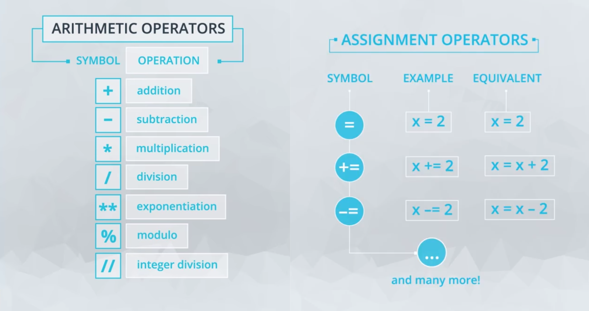

# Welcome To Introduction To Python

In this course, we use Python version 3 (or simply Python 3). If you'd like more details on previous versions of Python and how version 3 differs from previous versions, check out the History of Python on Wikipedia. If you're new to Python or programming in general, this article will make more sense after you've completed a lesson or two, so you may want to hold off for now. All you need to know now is that your solution code for the programming exercises in this course will be graded based on Python 3 code.

- [Welcome To Introduction To Python](#welcome-to-introduction-to-python)
  - [Why Python Programming](#why-python-programming)
    - [Programming In Python](#programming-in-python)
    - [Introduction to Programming](#introduction-to-programming)
  - [Data Types and Operators](#data-types-and-operators)
    - [Introduction L2](#introduction-l2)
    - [Arithmetic Operators](#arithmetic-operators)
    - [Quiz: Arithmetic Operators](#quiz-arithmetic-operators)
    - [Variables and Assignment Operators](#variables-and-assignment-operators)
    - [Quiz: Variables and Assignment Operators](#quiz-variables-and-assignment-operators)
    - [Integers and Floats](#integers-and-floats)
    - [Quiz: Integer vs Float](#quiz-integer-vs-float)
    - [Booleans, Comparison Operators, and Logical Operators](#booleans-comparison-operators-and-logical-operators)
    - [Quiz: Which is denser, Rio or San Francisco](#quiz-which-is-denser-rio-or-san-francisco)
    - [Strings](#strings)
    - [Quiz: String](#quiz-string)
    - [Type And Type Conversion](#type-and-type-conversion)
    - [Quiz: Type and Type Conversion](#quiz-type-and-type-conversion)
    - [String Methods](#string-methods)
    - [Quiz: String Methods](#quiz-string-methods)
    - [Another important string method: `split()`](#another-important-string-method-split)
    - [Quiz: String Methods Coding Practice](#quiz-string-methods-coding-practice)
    - ["There's a Bug in my Code"](#theres-a-bug-in-my-code)
    - [Summary](#summary)
  - [Data Structures](#data-structures)
    - [Introduction L3](#introduction-l3)
    - [List and Memberships Operators](#list-and-memberships-operators)

## Why Python Programming

In this module we learn why you use Python Language.

### Programming In Python

As you learn Python throughout this course, there are a few things you should keep in mind.

- Python is case sensitive.
- Spacing is important.
- Use error messages to help you learn.

Let’s get started!

### Introduction to Programming

When we go about using technology every single day we don't realize that these programs are build by people who learned how to code and if they can learn so can anyone. I have no background at all in and I wanted to do it but I never believed that I could. But now I'm finishing up now I'm kind of seeing myself professionally in that environment you can work alongside who have tech skills or you can become an engineer yourself honestly the options are endless.  

## Data Types and Operators

### Introduction L2

**Data Types And Operators**:

Welcome to this lesson on Data Types and Operators! You'll learn about:

- `Data Types`: Integers, Floats, Booleans, Strings
- `Operators`: Arithmetic, Assignment, Comparison, Logical
- Built-In Functions, Type Conversion
- Whitespace and Style Guidelines

```py
print(3 + 5) # print() is a built-in function that displays input value as text in the output.
8
```

### Arithmetic Operators

Arithmetic Operators
Arithmetic operators

- `+` Addition
- `-` Subtraction
- `*` Multiplication
- `/` Division
- `%` Mod (the remainder after dividing)
- `**` Exponentiation (note that ^ does not do this operation, as you might have seen in other languages)
- `//` Divides and rounds down to the nearest integer
The usual order of mathematical operations holds in Python, which you can review in this Math Forum page if needed.

[Bitwise operators][1] are special operators in Python that you can learn more about here if you'd like.

### Quiz: Arithmetic Operators

**Quiz: Average Electricity Bill**:

It's time to try a calculation in Python!

My electricity bills for the last three months have been `$23`, `$32` and `$64`. What is the average monthly electricity bill over the three month period? Write an expression to calculate the mean, and use `print()` to view the result.

**Solution**:

```py
# Write an expression that calculates the average of 23, 32 and 64
# Place the expression in this print statement
print((23 + 32 + 64) / 3)
```

**Quiz: Calculate**:

In this quiz you're going to do some calculations for a tiler. Two parts of a floor need tiling. One part is 9 tiles wide by 7 tiles long, the other is 5 tiles wide by 7 tiles long. Tiles come in packages of 6.

How many tiles are needed?
You buy 17 packages of tiles containing 6 tiles each. How many tiles will be left over?

```py
# Fill this in with an expression that calculates how many tiles are needed.
print((9 * 7) + (5 * 7))

# Fill this in with an expression that calculates how many tiles will be left over.
print((17 * 6) - ((9 * 7) + (5 * 7)))
```

### Variables and Assignment Operators

From this page, you will get your first look at variables in Python. There are three videos in this concept to show you some different cases you might run into!

**Variables I**:

Variables are used all the time in Python! Below is the example you saw in the video where we performed the following:

```py
mv_population = 74728
```

Here `mv_population` is a variable, which holds the value of `74728`. This assigns the item on the right to the name on the left, which is actually a little different than mathematical equality, as `74728` does not hold the value of `mv_population`.

In any case, whatever term is on the left side, is now a name for whatever value is on the right side. Once a value has been assigned to a variable name, you can access the value from the variable name.

```py
x = 2
y = x
print(y) # 2
```

**Variables II**:

In this video you saw that the following two are equivalent in terms of assignment:

```py
x = 3
y = 4
z = 5
```

and

```py
x, y, z = 3, 4, 5
```

However, the above isn't a great way to assign variables in most cases, because our variable names should be descriptive of the values they hold.

Besides writing variable names that are descriptive, there are a few things to watch out for when naming variables in Python.

`1.` Only use ordinary letters, numbers and underscores in your variable names. They can’t have spaces, and need to start with a letter or underscore.

`2.` **You can’t use reserved words or built-in identifiers** that have important purposes in Python, which you’ll learn about throughout this course. A list of python reserved words is described here. Creating names that are descriptive of the values often will help you avoid using any of these words. A quick table of these words is also available below.

`3.` The `pythonic way` to name variables is to use all lowercase letters and underscores to separate words.

`YES`

```py
my_height = 58
my_lat = 40
my_long = 105
```

`NO`

```py
my height = 58
MYLONG = 40
MyLat = 105
```

Though the last two of these would work in python, they are not pythonic ways to name variables. The way we name variables is called snake case, because we tend to connect the words with underscores.

```py
mv_population = 74728
mv_population += 4000 - 600 # instead of using mv_population twice we can do like this
print(mv_population) # 78128
```

**Assignment Operators**:

Below are the assignment operators from the video. You can also use *= in a similar way, but this is less common than the operations shown below. You can find some practice with much of what we have already covered [here][2].

### Quiz: Variables and Assignment Operators

**Quiz: Assign and Modify Variables**:

Now it's your turn to work with variables. The comments in this quiz (the lines that begin with #) have instructions for creating and modifying variables. After each comment write a line of code that implements the instruction.

Note that this code uses scientific notation to define large numbers. `4.445e8` is equal to `4.445 * 10 ** 8` which is equal to `444500000.0`.

```py
# The current volume of a water reservoir (in cubic metres)
reservoir_volume = 4.445e8
# The amount of rainfall from a storm (in cubic metres)
rainfall = 5e6

# decrease the rainfall variable by 10% to account for runoff
rainfall *= .9

# add the rainfall variable to the reservoir_volume variable
reservoir_volume += rainfall

# increase reservoir_volume by 5% to account for stormwater that flows
# into the reservoir in the days following the storm
reservoir_volume *= 1.05

# decrease reservoir_volume by 5% to account for evaporation
reservoir_volume *= 0.95

# subtract 2.5e5 cubic metres from reservoir_volume to account for water
# that's piped to arid regions.
reservoir_volume -= 2.5e5

# print the new value of the reservoir_volume variable
print(reservoir_volume) # 447627500.0
```

**Quiz: Changing Variable Values**:

How does changing the value of a variable affect another variable that was defined in terms of it? Let's look at an example.

We're intentionally not providing a place to execute the code here, because we want to help you practice the important skill of walking through lines of code by hand.

Each line of code executes in order, one at a time, with control going from one line to the next.

```py
>>> carrots = 24
>>> rabbits = 8
>>> crs_per_rab = carrots/rabbits
```

Now we add a new 4th line to this code, that assigns a new value to the rabbits variable:

```py
>>> rabbits = 12
```

QUESTION 2 OF 3
If we now add this new 5th line of code to the above, what will the output be?

```py
>>> print(crs_per_rab) #3.0
```

### Integers and Floats

**Integers and Floats**:

There are two Python data types that could be used for numeric values:

`int` - for integer values
`float` - for decimal or floating point values

You can create a value that follows the data type by using the following syntax:

```py
x = int(4.7)   # x is now an integer 4
y = float(4)   # y is now a float of 4.0
```

You can check the type by using the type function:

```py
>>> print(type(x))
int
>>> print(type(y))
float
```

Because the `float`, or `approximation`, for `0.1` is actually `slightly more than 0.1`, when we add several of them together we can see the difference between the mathematically correct answer and the one that Python creates.

```py
>>> print(.1 + .1 + .1 == .3)
False
```

You can see more on this [here][3].

**Python Best Practices**:

For all the best practices, see the [PEP8 Guidelines][4].

You can use the atom package [linter-python-pep8][5] to use pep8 within your own programming environment in the Atom text editor, but more on this later. If you aren't familiar with text editors yet, and you are performing all of your programming in the classroom, no need to worry about this right now.

Follow these guidelines to make other programmers and future you happy!

`Good`

```py
print(4 + 5)
```

`Bad`

```py
print(                       4 + 5)
```

You should limit each line of code to `80` characters, though `99` is okay for certain use cases. [You can thank IBM for this ruling][6].

Why are these conventions important? Although how you format the code doesn’t affect how it runs, following standard style guidelines makes code easier to read and consistent among different developers on a team.

### Quiz: Integer vs Float

**`int` vs. `float`**:

In the fishy situation below, some of the quantities are of type `int` and some are of type `float`. Check all the ones that should be of type `float`.

- Length of fish you caught.
- Length of time it took to catch the fish, in hours.

**Divide By Zero?**:

What happens if you divide by zero in Python? Try it out! Test run this code and see what happens.

Here's what you should have seen when you submitted the Divide by Zero code above:

```log
Traceback (most recent call last):
  File "/tmp/vmuser_tnryxwdmhw/quiz.py", line 1, in <module>
    print(5/0)

ZeroDivisionError: division by zero
```

`Traceback` means `"What was the programming doing when it broke"`! This part is usually less helpful than the very last line of your error. Though you can dig through the rest of the error, looking at just the final line `ZeroDivisionError`, and the message says we `divided by zero`. Python is enforcing the rules of arithmetic!

In general, there are `two` types of errors to look out for

- Exceptions
- Syntax

An Exception is a problem that occurs when the code is running, but a 'Syntax Error' is a problem detected when Python checks the code before it runs it. For more information, see the Python tutorial page on [Errors and Exceptions][7].

### Booleans, Comparison Operators, and Logical Operators

The bool data type holds one of the values `True` or `False`, which are often encoded as `1` or `0`, respectively.

There are 6 comparison operators that are common to see in order to obtain a `bool` value:

**Comparison Operators**:

| Symbol Use Case | Bool  | Operation                |
| :-------------: | :---: | :----------------------- |
|      5 < 3      | False | Less Than                |
|      5 > 3      | True  | Greater Than             |
|     3 <= 3      | True  | Less Than or Equal To    |
|     3 >= 5      | False | Greater Than or Equal To |
|     3 == 5      | False | Equal To                 |
|     3 != 5      | True  | Not Equal To             |

And there are `three` logical operators you need to be familiar with:

| Logical Use        | Bool  | Operation                                                   |
| :----------------- | :---: | :---------------------------------------------------------- |
| 5 < 3 `and` 5 == 5 | False | `and` - Evaluates if all provided statements are True       |
| 5 < 3 `or` 5 == 5  | True  | `or` - Evaluates if at least one of many statements is True |
| `not` 5 < 3        | True  | `not` - Flips the Bool Value                                |

### Quiz: Which is denser, Rio or San Francisco

Try comparison operators in this quiz! This code calculates the population densities of Rio de Janeiro and San Francisco.

Write code to compare these densities. Is the population of San Francisco more dense than that of Rio de Janeiro? Print `True` if it is and `False` if not.

```py
sf_population, sf_area = 864816, 231.89
rio_population, rio_area = 6453682, 486.5

san_francisco_pop_density = sf_population/sf_area
rio_de_janeiro_pop_density = rio_population/rio_area

# Write code that prints True if San Francisco is denser than Rio, and False otherwise
print(san_francisco_pop_density > rio_de_janeiro_pop_density)
```

`or`

```py
if(san_francisco_pop_density > rio_de_janeiro_pop_density):
    print(True)
else:
    print(False)
```

### Strings

`String`: Data type for immutable ordered sequence of characters(letters, numbers, spaces, and symbols)

Strings in Python are shown as the variable type `str`. You can define a string with either double quotes `"` or single quotes `'`. If the string you are creating actually has one of these two values in it, then you need to be careful to assure your code doesn't give an error.

```py
>>> my_string = 'this is a string!'
>>> my_string2 = "this is also a string!!!"
```

You can also include a `\` in your string to be able to include one of these quotes:

```py
>>> this_string = 'Simon\'s skateboard is in the garage.'
>>> print(this_string)
```

`Simon's skateboard is in the garage.`

If we don't use this, notice we get the following error:

```py
>>> this_string = 'Simon's skateboard is in the garage.'
```

```py
  File "<ipython-input-20-e80562c2a290>", line 1
    this_string = 'Simon's skateboard is in the garage.'
                         ^
SyntaxError: invalid syntax
```

The color highlighting is also an indication of the error you have in your string in this second case. There are a number of other operations you can use with strings as well. In this video you saw a few:

```py
>>> first_word = 'Hello'
>>> second_word = 'There'
>>> print(first_word + second_word)
HelloThere

>>> print(first_word + ' ' + second_word)
Hello There

>>> print(first_word * 5)
HelloHelloHelloHelloHello

>>> print(len(first_word))
5
```

Unlike the other data types you have seen so far, you can also index into strings, but you will see more on this soon! For now, here is a small example. Notice Python uses 0 indexing - we will discuss this later in this lesson in detail.

```py
>>> first_word[0]
H

>>> first_word[1]
e
```

**The `len()` function**

`len()` is a built-in Python function that returns the length of an object, like a string. The length of a string is the number of characters in the string. This will always be an integer.

There is an example above, but here's another one:

```py
print(len("ababa") / len("ab"))
2.5
```

You know what the data types are for `len("ababa")` and `len("ab")`. Notice the data type of their resulting quotient here.

### Quiz: String

**Quiz: Fix the Quote**:

The line of code in the following quiz will cause a SyntaxError, thanks to the misuse of quotation marks. First run it with Test Run to view the error message. Then resolve the problem so that the quote (from [Henry Ford][8]) is correctly assigned to the variable `ford_quote`.

```py
# TODO: Fix this string!
ford_quote = 'Whether you think you can, or you think you can\'t--you\'re right.'
```

**QUESTION 2 OF 5**:

We’ve already seen that the type of objects will affect how operators work on them. What will be the output of this code?

```py
coconut_count = "34"
mango_count = "15"
tropical_fruit_count = coconut_count + mango_count
print(tropical_fruit_count)
```

`Solution`: The correct answer is `3415`, and `tropical_fruit_count is a string`. That’s because even though the characters inside the strings coconut_count and mango_count are numbers, the values of the variable coconut_count and mango_count are strings, and are treated as strings when it comes to the `+` operator being applied.

**Quiz: Write a Server Log Message**:

In this programming quiz, you’re going to use what you’ve learned about strings to write a logging message for a server.

You’ll be provided with example data for a user, the time of their visit and the site they accessed. You should use the variables provided and the techniques you’ve learned to print a log message like this one (with the username, url, and timestamp replaced with values from the appropriate variables):

`Yogesh accessed the site http://petshop.com/pets/reptiles/pythons at 16:20.`

Use the Test Run button to see your results as you work on coding this piece by piece.

```py
username = "Kinari"
timestamp = "04:50"
url = "http://petshop.com/pets/mammals/cats"

# TODO: print a log message using the variables above.
# The message should have the same format as this one:
# "Yogesh accessed the site http://petshop.com/pets/reptiles/pythons at 16:20."

output = username + ' accessed the site ' + url + ' at ' + timestamp + '.'
print(output)
```

**Quiz: `len()`**:

Use string concatenation and the `len()` function to find the length of a certain movie star's actual full name. Store that length in the `name_length` variable. Don't forget that there are spaces in between the different parts of a name!

```py
given_name = "William"
middle_names = "Bradley"
family_name = "Pitt"

# todo: calculate how long this name is
name_length = len(given_name + " " + middle_names + " " + family_name)

# Now we check to make sure that the name fits within the driving license character limit
# Nothing you need to do here
driving_license_character_limit = 28
print(name_length <= driving_license_character_limit)
```

**QUESTION 5 OF 5**:

We've just used the len function to find the length of strings. What does the len function return when we give it the integer 835 instead of a string?

`Solution`: Nice! The error message generated reads: `TypeError`: object of type `'int'` has no `len()`, which alludes to the fact that len only works on a `"sequence (such as a string, bytes, tuple, list, or range)` or a collection `(such as a dictionary, set, or frozen set)`," as per the [Python documentation][9].

### Type And Type Conversion

You have seen four data types so far:

`int`

`float`

`bool`

`string`

You got a quick look at `type()` from an earlier video, and it can be used to check the data type of any variable you are working with.

```py
>>> print(type(4))
int
>>> print(type(3.7))
float
>>> print(type('this'))
str
>>> print(type(True))
bool
```

You saw that you can change variable types to perform different operations. For example,

```py
"0" + "5"
```

provides completely different output than

```py
0 + 5
```

What do you think the below would provide?

```py
"0" + 5
```

How about the code here:

```py
0 + "5"
```

Checking your variable types is really important to assure that you are retrieving the results you want when programming.

### Quiz: Type and Type Conversion

**Quiz: Total Sales**:

In this quiz, you’ll need to change the types of the input and output data in order to get the result you want.

Calculate and print the total sales for the week from the data provided. Print out a string of the form `"This week's total sales: xxx"`, where xxx will be the actual total of all the numbers. You’ll need to change the type of the input data in order to calculate that total.

```py
mon_sales = "121"
tues_sales = "105"
wed_sales = "110"
thurs_sales = "98"
fri_sales = "95"

#TODO: Print a string with this format: This week's total sales: xxx
# You will probably need to write some lines of code before the print statement.
total_sales = int(mon_sales) + int(tues_sales) + int (wed_sales) + int(thurs_sales) + int(fri_sales)
print("This week\'s total sales: " + str(total_sales))
```

### String Methods

In this video you were introduced to methods. Methods are like some of the functions you have already seen:

1. `len`("this")
2. `type`(12)
3. `print`("Hello world")

These three above are **functions** - notice they use parentheses, and accept one or more **arguments**. Functions will be studied in much more detail in a later lesson!

A `method` in Python behaves similarly to a function. Methods actually are functions that are called using dot notation. For example, `lower()` is a string method that can be used like this, on a string called "sample string": `sample_string.lower()`.

Methods are specific to the data type for a particular variable. So there are some built-in methods that are available for all strings, different methods that are available for all integers, etc.

Below is an image that shows some methods that are possible with any string.


Each of these methods accepts the string itself as the first argument of the method. However, they also could receive additional arguments, that are passed inside the parentheses. Let's look at the output for a few examples.

```py
>>> my_string.islower()
True
>>> my_string.count('a')
2
>>> my_string.find('a')
3
```

You can see that the `count` and `find` methods both take another argument. However, the `.islower()` method does not accept another argument.

No professional has all the methods memorized, which is why understanding how to use documentation and find answers is so important. Gaining a strong grasp of the foundations of programming will allow you to use those foundations to use documentation to build so much more than someone who tries to memorize all the built-in methods in Python.

**One important string method: `format()`**:

We will be using the `format()` string method a good bit in our future work in Python, and you will find it very valuable in your coding, especially with your `print` statements.

We can best illustrate how to use `format()` by looking at some examples:

**Example 1**:

```py
print("Mohammed has {} balloons".format(27))
```

**Example 1 Output**:

```py
Mohammed has 27 balloons
```

**Example 2**:

```py
animal = "dog"
action = "bite"
print("Does your {} {}?".format(animal, action))
```

**Example 2 Output**:

```py
Does your dog bite?
```

**Example 3**:

```py
maria_string = "Maria loves {} and {}"
print(maria_string.format("math", "statistics"))
```

**Example 3 Output**:

```py
Maria loves math and statistics
```

Notice how in each example, the number of pairs of curly braces {} you use inside the string is the same as the number of replacements you want to make using the values inside `format()`.

More advanced students can learn more about the formal syntax for using the `format()` string method [here][10].

### Quiz: String Methods

**QUESTION 1 OF 3**:

What happens when you call a string method like `islower()` on a float object? For example, `13.37.islower()`.

There is a playground workspace further down this page that you can use to experiment.  

`Solution`: An error occurs

You can learn more about strings and string methods by looking at the [string method documentation][12].

You will find that the documentation is one of the most valuable resources for writing code, and not only when it comes to strings or writing code in Python! By reading and searching the documentation you can learn about data types and built-in functions as well as how to use them.

### Another important string method: `split()`

A helpful string method when working with strings is the .split method. This function or method returns a data container called a `list` that contains the words from the input string. We will be introducing you to the concept of lists in the next video.

The split method has two additional arguments (`sep` and `maxsplit`). The sep argument stands for "separator". It can be used to identify how the string should be split up (e.g., whitespace characters like space, tab, return, newline; specific punctuation (e.g., comma, dashes)). If the sep argument is not provided, the default separator is whitespace.

True to its name, the maxsplit argument provides the maximum number of splits. The argument gives maxsplit + 1 number of elements in the new list, with the remaining string being returned as the last element in the list. You can read more about these methods in the Python documentation too.

Here are some examples for the `.split()` method.

A basic split method:

```py
new_str = "The cow jumped over the moon."
new_str.split()
```

Output is:

```py
['The', 'cow', 'jumped', 'over', 'the', 'moon.']
```

Here the separator is space, and the maxsplit argument is set to 3.

```py
new_str.split(' ', 3)
```

Output is:

```py
['The', 'cow', 'jumped', 'over the moon.']
```

Using '.' or period as a separator.

```py
new_str.split('.')
```

Output is:

```py
['The cow jumped over the moon', '']
```

Using no separators but having a maxsplit argument of 3.

```py
new_str.split(None, 3)
```

Output is:

```py
['The', 'cow', 'jumped', 'over the moon.']
```

### Quiz: String Methods Coding Practice

Below, we have a string variable that contains the first verse of the poem, If by Rudyard Kipling. Remember, \n is a special sequence of characters that causes a line break (a new line).

```py
verse = "If you can keep your head when all about you\n  Are losing theirs and blaming it on you,\nIf you can trust yourself when all men doubt you,\n  But make allowance for their doubting too;\nIf you can wait and not be tired by waiting,\n  Or being lied about, don’t deal in lies,\nOr being hated, don’t give way to hating,\n  And yet don’t look too good, nor talk too wise:"
```

Use the code editor below to answer the following questions about verse and use Test Run to check your output in the quiz at the bottom of this page.

1. What is the length of the string variable `verse?
1. What is the index of the first occurrence of the word 'and' in verse?
1. What is the index of the last occurrence of the word 'you' in verse?
1. What is the count of occurrences of the word 'you' in the verse?
You will need to refer to Python's string methods documentation.

**Solution: String Methods Practice**:

**Version 1**:

```py
verse = "If you can keep your head when all about you\n  Are losing theirs and blaming it on you,\nIf you can trust yourself when all men doubt you,\n  But make allowance for their doubting too;\nIf you can wait and not be tired by waiting,\n  Or being lied about, don’t deal in lies,\nOr being hated, don’t give way to hating,\n  And yet don’t look too good, nor talk too wise:"
print(verse, "\n")

print("Verse has a length of {} characters.".format(len(verse)))
print("The first occurrence of the word 'and' occurs at the {}th index.".format(verse.find('and')))
print("The last occurrence of the word 'you' occurs at the {}th index.".format(verse.rfind('you')))
print("The word 'you' occurs {} times in the verse.".format(verse.count('you')))
```

**Version 2**:

Here's another way you could write the print statements and get the same output.

```py
verse = "If you can keep your head when all about you\n  Are losing theirs and blaming it on you,\nIf you can trust yourself when all men doubt you,\n  But make allowance for their doubting too;\nIf you can wait and not be tired by waiting,\n  Or being lied about, don’t deal in lies,\nOr being hated, don’t give way to hating,\n  And yet don’t look too good, nor talk too wise:"
print(verse, "\n")

message = "Verse has a length of {} characters.\nThe first occurrence of the \
word 'and' occurs at the {}th index.\nThe last occurrence of the word 'you' \
occurs at the {}th index.\nThe word 'you' occurs {} times in the verse."

length = len(verse)
first_idx = verse.find('and')
last_idx = verse.rfind('you')
count = verse.count('you')

print(message.format(length, first_idx, last_idx, count))
```

**Output**:

```text
If you can keep your head when all about you
  Are losing theirs and blaming it on you,
If you can trust yourself when all men doubt you,
  But make allowance for their doubting too;
If you can wait and not be tired by waiting,
  Or being lied about, don’t deal in lies,
Or being hated, don’t give way to hating,
  And yet don’t look too good, nor talk too wise:

Verse has a length of 362 characters.
The first occurrence of the word 'and' occurs at the 65th index.
The last occurrence of the word 'you' occurs at the 186th index.
The word 'you' occurs 8 times in the verse.
```

### "There's a Bug in my Code"

**Debugging Code**:

Everyone gets "`bugs`," or `unexpected errors`, in their code, and this is a normal and expected part of software development. We all say at one time or another, "Why isn't this computer doing what I want it to do?!"

So an important part of coding is `"debugging"` your code, to remove these bugs. This can often take a long time, and cause you frustration, but developing effective coding habits and mental calmness will help you address these issues. With determined persistence, you can prevail over these bugs!

Here are some tips on successful debugging that we'll discuss in more detail below:

- Understand common error messages you might receive and what to do about them.
- Search for your error message, using the Web community.
- Use print statements.


- **Understanding Common Error Messages**:

There are many different error messages that you can receive in Python, and learning how to interpret what they're telling you can be very helpful. Here are some common ones for starters:

- **"ZeroDivisionError: division by zero."**:
   This is an error message that you saw earlier in this lesson. What did this error message indicate to us? You can look back in the Quiz: Arithmetic Operators section to review it if needed.

- **"SyntaxError: unexpected EOF while parsing"**:
   Take a look at the two lines of code below. Executing these lines produces this syntax error message - do you see why?

  ```py
  greeting = "hello"
  print(greeting.upper
  ```

  This message is often produced when you have accidentally left out something, like a parenthesis. The message is saying it has unexpectedly reached the end of file `("EOF")` and it still didn't find that right parenthesis. This can easily happen with code syntax involving pairs, like beginning and ending quotes also.

- **"TypeError: len() takes exactly one argument (0 given)"**:
   This kind of message could be given for many functions, like `len` in this case, if I accidentally do not include the required number of arguments when I'm calling a function, as below. This message tells me how many arguments the function requires (one in this case), compared with how many I gave it (0). I meant to use `len(chars)` to count the number of characters in this long word, but I forgot the argument.

  ```py
  chars = "supercalifragilisticexpialidocious"
  len()
  ```

  There are other kinds of error messages that you'll certainly begin experiencing soon in your Python work. Learning what they mean and how to address them will help you debug your code. You might keep an ongoing page of notes on them.

**Search for Your Error Message**:

Software developers like to share their problems and solutions with each other on the web, so using Google search, or searching in StackOverflow, or searching in Udacity's Knowledge forum are all good ways to get ideas on how to address a particular error message you're getting.

- Copy and paste the error message into your web browser search tab, or in Knowledge, and see what others suggest about what might be causing it.
- You can copy and paste the whole error message, with or without quotes around it.
- Or you can search using just key words from the error message or situation you're facing, along with some other helpful words that describe your context, like Python and Mac.

**Use Print Statements to Help Debugging**:

Adding print statements temporarily into your code can help you see which code lines have been executed before the error occurs, and see the values of any variables that might be important. This approach to debugging can also be helpful even if you're not receiving an error message, but things just aren't working the way you want.

### Summary

You learned a ton in this lesson! To summarize, here's a recap of the data types and operators we covered.

**Data Types**:

We covered four important data types that you'll use all the time in programming:
| Data Type | Constructor       | Example            |
| :-------- | :---------------- | :----------------- |
| int       | int()             | 5                  |
| float     | float()           | 6.5                |
| string    | '' or "" or str() | "this is a string" |
| bool      | bool()            | True or False      |

**Operators**:

We also covered four useful sets of operators:




**Additional Practice Resources**:

When many students are getting started, they often always want more practice. There are a number of great websites you can use for coding exercises and solutions. Two that you should definitely take advantage of are [HackerRank][13] and [Codewars][14].

**Note**: You may find some of the exercises require knowledge on concepts you haven't learned yet. Feel free to google them, or wait until you've gone through all the lessons in this course.

I encourage you to create a profile on both and commit to improving your Python programming skills! As you get better, you can advance to harder problems and sites with even greater challenges. If you spend a lot of time on this, you'll really become a Python programming master.

Happy coding and see you in the next lesson!

## Data Structures

Use data structures to order and group different data types together! Learn about the types of data structures in Python, along with more useful built-in functions and operators.

### Introduction L3

Welcome to this lesson on Data Structures! You'll learn about:

1. Types of Data Structures: `Lists`, `Tuples`, `Sets`, `Dictionaries`, `Compound` Data Structures
1. `Operators`: `Membership`, `Identity`
1. Built-In Functions or `Methods`

### List and Memberships Operators

**Lists**:

**Data structures** are containers that organize and group data types together in different ways. A **list** is one of the most common and basic data structures in Python.

You saw here that you can create a list with square brackets. Lists can contain any mix and match of the data types you have seen so far.

```py
list_of_random_things = [1, 3.4, 'a string', True]
```

This is a list of 4 elements. All ordered containers (like lists) are indexed in python using a starting index of 0. Therefore, to pull the first value from the above list, we can write:

```py
>>> list_of_random_things[0]
1
```

It might seem like you can pull the last element with the following code, but this actually won't work:

```py
>>> list_of_random_things[len(list_of_random_things)] 
---------------------------------------------------------------------------
IndexError                                Traceback (most recent call last)
<ipython-input-34-f88b03e5c60e> in <module>()
----> 1 lst[len(lst)]

IndexError: list index out of range
```

However, you can retrieve the last element by reducing the index by 1. Therefore, you can do the following:

```py
>>> list_of_random_things[len(list_of_random_things) - 1] 
True
```

Alternatively, you can index from the end of a list by using negative values, where -1 is the last element, -2 is the second to last element and so on.

```py
>>> list_of_random_things[-1] 
True
>>> list_of_random_things[-2] 
a string
```

**Slice and Dice with Lists**:

You saw that we can pull more than one value from a list at a time by using `slicing`. When using slicing, it is important to remember that the `lower` index is `inclusive` and the `upper` index is `exclusive`.

Therefore, this:

```py
>>> list_of_random_things = [1, 3.4, 'a string', True]
>>> list_of_random_things[1:2]
[3.4]
```

will only return `3.4` in a list. Notice this is still different than just indexing a single element, because you get a list back with this indexing. The colon tells us to go from the starting value on the left of the colon up to, but not including, the element on the right.

If you know that you want to start at the beginning, of the list you can also leave out this value.

```py
>>> list_of_random_things[:2]
[1, 3.4]
or to return all of the elements to the end of the list, we can leave off a final element.

>>> list_of_random_things[1:]
[3.4, 'a string', True]
```

This type of indexing works exactly the same on strings, where the returned value will be a string.

**Are you `in` OR `not in`?**:

You saw that we can also use `in` and `not in` to return a **bool** of whether an element exists within our list, or if one string is a substring of another.

```py
>>> 'this' in 'this is a string'
True
>>> 'in' in 'this is a string'
True
>>> 'isa' in 'this is a string'
False
>>> 5 not in [1, 2, 3, 4, 6]
True
>>> 5 in [1, 2, 3, 4, 6]
False
```


<!-- urls / paths -->
[1]: https://wiki.python.org/moin/BitwiseOperators
[2]: https://www.programiz.com/python-programming/operators
[3]: https://docs.python.org/3/tutorial/floatingpoint.html
[4]: https://www.python.org/dev/peps/pep-0008/
[5]: https://atom.io/packages/linter-python-pep8
[6]: https://softwareengineering.stackexchange.com/questions/148677/why-is-80-characters-the-standard-limit-for-code-width
[7]: https://docs.python.org/3/tutorial/errors.html
[8]: https://www.goodreads.com/author/quotes/203714.Henry_Ford
[9]: https://docs.python.org/2/library/functions.html#len
[10]: https://docs.python.org/3.6/library/string.html#format-string-syntax
[11]: https://docs.python.org/3/library/stdtypes.html#string-methods
[12]: https://docs.python.org/3/library/stdtypes.html#string-methods
[13]: https://www.hackerrank.com/domains/python
[14]: https://www.codewars.com/dashboard
