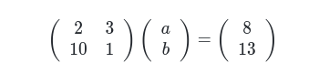
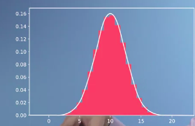

# Mathematics for Machine Learning

In the first course on Linear Algebra we look at what linear algebra is and how it relates to data. Then we look through what vectors and matrices are and how to work with them.

## Welcome to the Course

### Introduction: Solving data science challenges with mathematics

Hi there, I'm David Dye, and welcome to the Mathematics for Machine Learning specialization. Before we get stuck in, let's set the scene.

**Machine learning is a set of powerful mathematical tools that enable us, to represent, interpret, and control the complex world around us.**

However, even just the word mathematics makes some people feel uneasy and unwelcome to explore the topic. The purpose of this specialization is to take you on a tour through the basic maths underlying these methods, focusing in particular on building your intuition rather than worrying too much about the details. Thanks to the amazing machine learning community, it's actually possible to apply many powerful machine learning methods without understanding very much about the underpinning mathematics, by using open source libraries. This is great, but problems can arise and without some sense of the language and meaning of the relevant maths, you can struggle to work out what's gone wrong or how to fix it. The ideal outcome of this specialization is that it will give you the confidence and motivation to immediately dive into one of the hundreds of boolean applied machine learning courses already available online, and not be intimidated by the matrix notation or the calculus. We want to open up machine learning to as many people as possible, and not just leave all the fun to computer scientists. This first course offers the `introduction to linear algebra which is essentially a set of notational conventions and handy operations, that allow you to manipulate large systems of equations conveniently`. Over the next five modules, we'll be focusing on building your intuition about `vectors` and `translations` through the use of quizzes and interactive widgets as well as occasionally asking you to fill in the gaps in some `Python coding` examples. In the final module, Dr. Sam Cooper will bring it all together by showing you how linear algebra is at the heart of `Google's famous page rank algorithm`, which is used for deciding the order of web pages in search results. Hopefully, if you find this course useful, you'll stick around for a follow-on course by Sam and I who will introduce you to `multivariate calculus`. Then, in our other course Dr. Mark Dyes and I will introduce `principal component analysis`.

### How to be successful in this course

**Tips for studying online**:

Having all the freedom to study online is nice, but this might make it difficult to focus and start studying. When learning online, you should become a self-directed learner!

Here are some great tips for you, collected from this [blog][1], on how to be successful in your online class:

1. Read the syllabus: all the important information can be found here!
1. Plan weekly study times
1. Log on to the class at least 3 times a week
1. Ask questions
1. Make connections with your fellow learners

**Requirements**:

This course explains some of the fundamentals of Linear Algebra and translates these to the basics of Machine Learning. As a learner, you will practice with these basics and in order to do so you’ll find exercises that require different types of interactivity. Alongside video lectures and quizzes, you’ll also get to work with code blocks and Jupyter Notebooks. These are integrated within the course: you don’t need any specific hardware or software packages to access these.

### Additional readings & helpful references

Head to Resources to see our [handy formula][2] sheet which summarises all the equations on the course.

Below you find a selection of additional material for you that may be helpful to keep alongside the course.

Please note that this material is optional and not intended as integral part of the course.

**Books**:

In the UK, we tend to write our courses from scratch based on what we think is important to include and introduce things in the order we think presents the material in the most elegant and illuminating way - we don't just go through a particular set textbook. So there isn't an exact 'model text' that we are following in this course. But, our way of thinking about things is informed by the textbooks we use, the teachers who taught us, how we use things in research and by interactions with our own students - so of course all sorts of textbooks are useful.

In Imperial Engineering, our primary maths textbook is probably the ever-popular and accessible Mathematical Methods in the Physical Sciences by Mary L Boas, John Wiley and Sons, 3rd Ed, 2006. Linear Algebra is in Chapter 3. Most Engineering maths textbooks are also useful, although they often teach 'vectors and matrices' rather than viewing linear algebra as an integrated whole.
In US graduate school classes people often use Introduction to Linear Algebra by `Gilbert Strang`, Wellesley-Cambridge Press, 5th Ed, 2016. <http://math.mit.edu/~gs/linearalgebra/>

**Web Resources**:

There are, of course, a whole bunch of useful web resources on linear algebra - many of which were helpful to us in preparing this course! These might also be handy to you - typically they go a bit slower or have a different emphasis or way of explaining things, but it can be handy to see how someone else explains something.

1. Khan Academy is a great resource right up to 1st or 2nd year undergraduate material. For this course, there's a handy group of videos at <https://www.khanacademy.org/math/linear-algebra>

2. Grant Sanderson has a great series of videos developing mathematical intuition on YouTube, which you can reach through his site <http://www.3blue1brown.com>

3. Wikipedia gets better every year - and the linear algebra wikipedia pages are actually pretty good. <https://en.wikipedia.org/wiki/Linear_algebra>

## The Relationship Between Machine Learning, Linear Algebra, Vectors and Matrices

### Motivation for Linear Algebra

1. The problem of apples and bananas, of solving simultaneous equations.

        2a  + 3b = 8                    a -> apple, b -> banana
        10a + 1b = 13                   10 -> 10 apple

   

2. And secondly, the optimization problem of fitting some data with an equation with some fitting parameters, and these problems we'll go on to look at and motivates our work right through the course on Linear Algebra, and it's partner of multivariate calculus.

   

### Getting a Handle on Vector

The histogram distribution of heights of people in the population. There aren't many people above about 2 meters, say. And there aren't really very many people below 1.5 meters.

Say we wanted to try fitting that distribution with an equation describing the variation of height in the population. And let's say that equation has just `two parameters`. One describing the `center of the distribution` here, and we'll call that `mu`. And one describing how `wide` it is, which we'll call `sigma`.

So we could fit it with some curve that had two parameters, mu and sigma. I would use an equation like this. I'd call it `f(x)`, some function of x where `x is the height`, => 1 over `sigma root 2 pi` times the `exponential` of `- (x - mu)` `squared divided by 2 sigma squared`. So this equation only has `two parameters`, `sigma` here and `mu`, and it looks like this. And it has an area here of 1, because there's only 100% of people in the population as a whole. Now don't worry too much about the form of the equation. This is what happens, `this is called the normal or Gaussian distribution. And it's got a center of mu and a width of sigma. And it's normalized, so that it's area is 1.`

Now, how do we go about `fitting this distribution`? That is, finding mu and sigma, well, the best possible mu and sigma that fits the data as well as is possible.

Imagine that we had guessed that the width was wider than it really is, but keeping the area of 1. So if we guessed that it was a `fatter and probably a bit shorter distribution`, something like that, say. So this one has something like that. This one has a `wider sigma`, but it's got the same `mu`. It'd be too high at the edges here, and too low in the middle. So then we could add up the differences between all of our measurements, and all of our `estimates`. We've got all of these places where we `underestimate` here, and all of these places where we `overestimate` here. And we could add up those differences or, in fact, the squares of them to get a measure of the `goodness` or `badness` of the `fit`. And we'll look in detail at how we do that once we've done all the `vectors` work, and once we've done actually all the `calculus` work, then we could `plot` how that `goodness varied as we change the fitting parameters, sigma and mu`, and we get a plot like this. So if we had a correct value, our best possible value for mu here, and our best possible value for the width, sigma here.

We could then plot, for a given value of mu and sigma, what the difference was. So if we were at the right value, we'd get a value of goodness where the sum of the squares of the differences was nought. And if mu was too far over, if we had mis-estimated mu and we got the distribution shifted over, so the width was right, but we had some wrong value of mu there, that we get some value of all the sums of the squares of the differences of goodness being some value here that was higher. And it might be the same if we went over the other side and we had some value there. And if we were too wide, we'd get something there or too thin, we'd get something that was too thin like that, something like that, say. So we'd get some other value of goodness. We could imagine plotting out all of the values of where we have the same value of goodness or badness for different values of mu and sigma. And we could then do that for some other value of badness, and we might get a `contour` that looked like this, and another contour that looked like this, and so on and so forth. Now, say we don't want to compute the value of this goodness parameter for every possible mu and sigma. We just want to do it a few times, and then find our way to the best possible fit of all.

Say we started off here with some guess that was too big a mu and too small a width. We thought people were taller than they really are, and that they were tighter packed in their heights than they really are. But what we could do is we could say well, if I do a little move in mu and sigma, then does it get better or worse? And if it gets better, well, we'll keep moving that direction. So we could imagine making a vector of a change in mu and a change in sigma. And we could have our original mu and sigma there. And we could have a new value, mu prime, sigma prime, and ask if that gives us a better answer? If it's better there or if mu prime sigma prime took us over here? If we were better or worse there, something like that.

Now actually, if we could find what the steepest way down the hill was, then we could go down this set of `contours, this sort of landscape here towards the minimum point, towards the point where get the best possible fit`. And what we're doing here, these are vectors, these are little moves around space. They're not moves around a physical space, they're moves around a parameter space, but it's the same thing. So if we understand vectors and we understand how to get down hills, that sort of curviness of this value of goodness, that's calculus. Then once we got calculus and vectors, we'll be able to solve this sort of problem. So we can see that vectors don't have to be just geometric objects in the physical order of space. They can describe directions along any sorts of axes. So we can think of vectors as just being lists. If we thought of the space of all possible cars, for example. `So here's a car. There's its back, there's its window, there's the front, something like that. There's a car, there's the window. We could write down in a vector all of the things about the car. We could write down its cost in euros. We could write down its emissions performance in grams of CO2 per 100 kilometers. We could write down its Nox performance, how much it polluted our city and killed people due to air pollution. We could write down its Euro NCAP star rating, how good it was in a crash. We could write down its top speed. And write those all down in a list that was a vector.` That'd be more of a computer science view of vectors, whereas the spatial view is more familiar from physics. In my field, metallurgy, I could think of any alloy as being described by a vector that describes all of the possible components, all the compositions of that alloy. Einstein, when he conceived relativity, conceived of time as just being another dimension. So space-time is a four dimensional space, three dimension of metres, and one of time in seconds. And he wrote those down as a vector of space-time of `x, y, z`, and time which he called space-time. When we put it like that, it's not so crazy to think of the space of all the fitting parameters of a function, and then of vectors as being things that take us around that space. `And what we're trying to do then is find the location in that space, where the badness is minimized, the goodness is maximized, and the function fits the data best`. If the badness surface here was like a `contour map of a landscape`, we're trying to find the bottom of the hill, the lowest possible point in the landscape. So to do this well, we'll want to understand how to work with vectors and then how to do calculus on those vectors in order to find gradients in these contour maps and minima and all those sorts of things. Then we'll be able to go and do optimizations, enabling us to go and work with data and do machine learning and data science.

**Question: What is a vector? Select all correct answers.**

- [X] A list of numbers.

        Vectors are usually viewed by computers as an ordered list of numbers which they can
        perform "operations" on - some operations are very natural and, as we will see, very useful!

- [X] Position in three dimensions of space and in one dimension of time.

        A vector in space-time can be described using 3 dimensions of space and 1 
        dimension of time according to some co-ordinate system.

- [X] Something which moves in a space of fitting parameters.

        As we will see, vectors can be viewed as a list of numbers which describes 
        some optimisation problem.

`Note:` Vectors can be thought of in a variety of different ways - some geometrically, some algebraically, some numerically. In this way, there are a lot of techniques one can use to deal with vectors.

<!-- Urls and paths -->
[1]: https://onlinelearninginsights.wordpress.com/2012/09/28/five-step-strategy-for-student-success-with-online-learning/
[2]: https://d3c33hcgiwev3.cloudfront.net/PoPGwxvuEein8Q5msPYVqg_3edb0e701bee11e8a3bbdda3bd061ec3_maths4ml-linearalgebra-formula.pdf?Expires=1604448000&Signature=B0HxVHc4WGynn57a4cQiBZAt---qNM-LipV9LzXt-4dSujtB93rJYx2mA6iCP03~SG6Z8sug4jm7DPKiJdfTbezAIhr5Z6tHrTiJ7nje619eFQ1jQnIB-SOR3qg1EpmwHkxRVw0qHeL~BNHJ-r1BZbExtt8k179h-su8tI1rY4Q_&Key-Pair-Id=APKAJLTNE6QMUY6HBC5A
