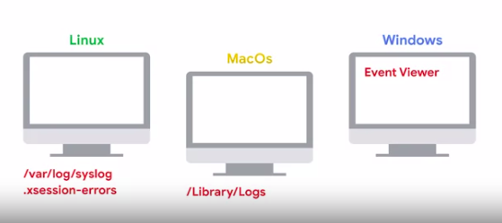
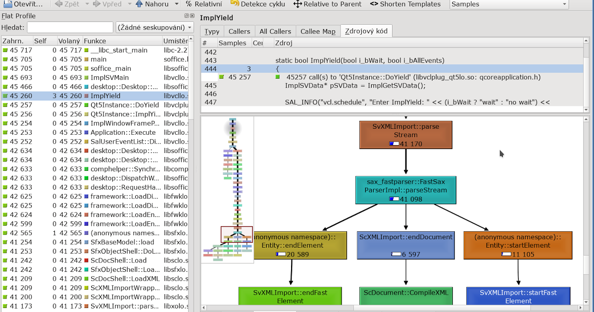

# Troubleshooting and Debugging Techniques

Google IT Automation with Python Course#4

## Module 1: Welcome To The Course

Welcome to the course!
In this course, you’ll learn how to debug and troubleshoot a wide range of technical problems, both in your code and in someone elses code.

### Course prerequisites

This course requires some familiarity with basic IT concepts:

- **Operating systems**: `file systems`, `processes`, `log files`
- **Computer hardware**: `CPU`, `RAM`, `disk`, `graphic`, and `network cards`
- **Basic networking**: `network connections` and `network bandwidth`

The example scripts and programs in this course are written in `Python`, so you’ll need an understanding of this programming language, too.

🔗 [Stack Overflow Troubleshoot][stackoverflow]

### Introduction to Debugging

Whether it's an application crashing, a hardware issue, or network outage, as IT specialists, we tend to run into problems that need solving pretty regularly. When facing these issues, we need to make sure that people affected by the problem can get back to doing their jobs as fast as possible. We also have to plan for how to prevent against the same problems from happening again in the future. In this module, we'll learn some essential debugging techniques.

We'll keep applying them throughout the course as we explore different issues that can affect us or the users we're supporting in different ways. As with any other skills that you've learned throughout this program, the best way to get good at something is practice. So at the end of the module, you'll have the opportunity to apply these techniques and try solving a technical issue yourself on a virtual machine running Linux.

### What is Debugging

**Troubleshooting**:

![Troubleshoot][troubleshoot-definition]

**Debugging**:

![Debug-Definition][debug-definition]

We sometimes use troubleshooting and debugging interchangeably. But generally, we say troubleshooting when we're fixing problems in the system running the application, and debugging when we're fixing the bugs in the actual code of the application.

There are lots of tools that we can use to get more information about the system and what the programs in our system are doing. Tools like, `tcpdump` and `Wireshark` can show us `ongoing network connections`, and help us analyze the traffic going over our cables.

Tools like `ps, top, or free` can show us the number and types of resources used in the system. We can use a tool like `strace` to look at the system calls made by a program, or `ltrace` to look at the library calls made by the software.

**Debuggers**:

![Debug][debuggers]

> Both troubleshooting and debugging is an art

### Problem Solving Skills

There's a wide range of different technical problems that you might face as an IT specialist or systems administrator. But fortunately, there's a set of steps that you can usually take to solve almost any technical problem.

- The `first step is getting information`. This means gathering as much information as we need about the current state of things, what the issue is, when it happens, and what the consequences are, for example. To get this information, we can use any existing documentation that might help. This can be `internal documentation`, `manual pages`, or `even questions asked on the Internet`.

One super important resource to solve a problem is the `reproduction case`, `which is a clear description of how and when the problem appears`.

- The `second step is finding the root cause of the problem`. `This is usually the most difficult step`. Throughout this course, we'll discuss a lot of possibilities on how to get there. But the key here is to get to the bottom of what's going on, what triggered the problem, and how we can change that.
- The `final step is performing the necessary remediation`. Depending on the problem, this might include an immediate remediation to get the system back to health, and then a medium or long-term remediation to avoid the problem in the future. While these are three basic steps of problem-solving, they don't always happen sequentially. It's pretty common that while trying to find the root cause, we discover that we need even more info about the current state. So we gather more information until we find the answer we're looking for, or we could understand the problem just enough to create a workaround that lets our users get back to work quickly, but we'd still need more time to get to the root cause and prevent the problem from happening again. Preventing the problem from occurring can sometimes feel like a hassle, but it can actually save us and our users a lot of valuable time. This way we avoid having to solve the same problem over and over again.
- `Throughout the whole process, it's important that we document what we do`. We should note down the info that we get, the different things we tested to try, and figure out the root cause. Finally, the steps we took to fix the issue. This documentation might prove invaluable next time a similar issue pops up.

- Imagine a user asks you for your help because their computer is unexpectedly shutting down. Computers shouldn't shut down on their own, but the problem could be a hardware issue, a software issue, or even a configuration issue. So the first thing to do is to get more information. You'll want to know things like when it happened, what the user was doing when it happened, and how regularly it's happening. You'll also want to look at the computer logs to check if there are any interesting errors. If any aren't totally clear, you can look them up on the Internet to see what they mean. In our example, safe on a line in the logs that says the temperature threshold was exceeded and so the computer shutdown. That's useful information, you know why the computer shut down but you don't know why it overheated, so you'll need to keep investigating. After not finding anything else interesting in the logs, you decide to check if it's a hardware issue. When you open up the computer, you find that the fan that's supposed to cool down the CPU is full of dirt, and so it isn't spinning properly. That's the root cause of the problem. Now, the short-term remediation is to clean up the fan so that it can spin again and the computer doesn't overheat. But what's the long-term remediation? In this case, it would be deploying monitoring on the computers to make sure you get notified early when they're overheating. Long-term remediation would also include checking if you can reduce the amount of dust in the air so that there's less chance of this happening again.

### Silently Crashing Application

#### `strace` - trace system calls and signals

```sh
> ls
practice.py

> python3 practice.py
-- Assume practice.py has some internal error --

> strace python3 practice.py

execve("/usr/bin/python3", ["python3", "practice.py"], 0x7fff670025e8 /* 61 vars */) = 0
brk(NULL)                               = 0x1dc8000
arch_prctl(0x3001 /* ARCH_??? */, 0x7ffc796d5850) = -1 EINVAL (Invalid argument)
access("/etc/ld.so.preload", R_OK)      = -1 ENOENT (No such file or directory)

-----------------------------------So many system calls------------------------------------

read(3, "def hello(name):\n    print(\"hi \""..., 8192) = 80
read(3, "", 8192)                       = 0
close(3)                                = 0
write(2, "    hello()\n", 12    hello()
)           = 12
write(2, "TypeError: hello() missing 1 req"..., 66TypeError: hello() missing 1 required positional argument: 'name'
) = 66
sigaltstack(NULL, {ss_sp=0x1e0e5c0, ss_flags=0, ss_size=16384}) = 0
sigaltstack({ss_sp=NULL, ss_flags=SS_DISABLE, ss_size=0}, NULL) = 0
exit_group(1)                           = ?
+++ exited with 1 +++

> strace -o failure.strace python3 practice.py
> less failure.strace

read(3, "def hello(name):\n    print(\"hi \""..., 8192) = 80
read(3, "", 8192)                       = 0
close(3)                                = 0
write(2, "    hello()\n", 12    hello()


:/hello
Enter..... and find the errors.
```

`strace` command shows us all the `system calls` are program made. `System calls` are the calls that the programs running on our computer make to the running `kernel`. There are loads of different system calls and depending on what we're trying to debug.

#### Practice Quiz: Introduction to Debugging

**Question 1**:

What is part of the final step when problem solving?

- [ ] Documentation
- [x] Long-term remediation
- [ ] Finding the root cause
- [ ] Gathering information

**Question 2**:

Which tool can you use when debugging to look at library calls made by the software?

- [ ] top
- [ ] strace
- [ ] tcpdump
- [x] ltrace

**Question 3**:

What is the first step of problem solving?

- [ ] Prevention
- [x] Gathering information
- [ ] Long-term remediation
- [ ] Finding the root cause

**Question 4**:

What software tools are used to analyze network traffic to isolate problems? (Check all that apply)

- [x] tcpdump
- [x] wireshark
- [ ] strace
- [ ] top

**Question 5**:

The strace (in Linux) tool allows us to see all of the **\_** our program has made.

- [ ] Network traffic
- [ ] Disk writes
- [x] System calls
- [ ] Connection requests

### It Does Not Work

As we called out, the first step to solving a problem is getting enough information so that we can understand the current state of things. To do this we'll need to know what the actual issue we're solving is. This starts when we first come across the issue, which can be through report by a ticketing system or by encountering the problem ourselves. When working with users, it's pretty common to receive reports of failures that just boil down to, "It doesn't work." These reports usually don't include a lot of useful information but it's still important that the problem gets reported and solved. Which information is useful or not might depend on the problem. But there are some common questions that we can ask a user that simply report something doesn't work.

![It Does Not Work][idnw]

What were you trying to do? What steps did you follow? What was the expected result? What was the actual result? If the ticketing system your company uses allows this, it's a good idea to include these questions in the form that users have to fill out when reporting an issue. This way we save time and can start asking more specific questions right away.

### Creating a Reproduction Case


See log files in different OS



### Finding The Root Cause

When you first come across these concepts, it might seem that once you have a reproduction case, you already know the root cause of the problem. But more often than not, it's not true......

... we have a test server running the same websites. When we start the backup, we see that the website stop responding. This is great because we have re-production case, and we can debug it properly. How do we find the root cause?

One possible culprit could be too much disk input and output. To get more info on this, we could use `iotop`, which is a tool similar to top that lets us see which processes are using the most input and output. Other related tools are `iostat` and `vmstat`, these tools show statistics on the input/output operations and the virtual memory operations. If the issue is that the process generates too much input or output, we could use a command like `ionice` to make our backup system reduce its priority to access the disk and let the web services use it too.

What if the input and output is not the issue? Another option would be that the service is using too much network because it's transmitting the data to be backed up to a central server and that transmission blocks everything else. We can check this using `iftop`, yet another tool similar to top that shows the current traffic on the network interfaces. If the backup is eating all the network bandwidth, we could look at the documentation for the backup software and check if it already includes an option to limit the bandwidth. The `rsync` command, which is often used for backing up data, includes a `-bwlimit`, just for this purpose. If that option isn't available, we can use a program like `Trickle` to limit the bandwidth being used.

But what if the network isn't the issue either? Remember, we need to put our debugging creativity to work, and come up with other possible reasons for why it's failing. Another option could be that the compression algorithms selected is too aggressive, and `compressing the backups` is using all of the server's processing power. We could solve this by reducing the compression level or using the `nice` command to reduce the priority of the process and accessing the CPU.

If that's still not the case, we need to keep looking, check the logs to see if we find anything that we missed before. Maybe look online for other people dealing with similar problems related to interactions of the backing up software with the web surfing software, and keep doing this until we come up with something that could be causing our problem. I know this sounds like a lot of work, but it's usually not that bad. In general, by using the tools available to us, we can find enough info to land on the right hypothesis after only a few tries and with experience, we'll get better at picking up the most likely hypothesis the first time around. Up next, we'll talk about a tricky type of technical problem that we all have to face, intermittent issues.

### Practice Quiz: Understanding the Problem

**Question 1**:

When a user reports that an "application doesn't work," what is an appropriate follow-up question to gather more information about the problem?

- [ ] Is the server plugged in?
- [ ] Why do you need the application?
- [ ] Do you have a support ticket number?
- [X] What should happen when you open the app?

**Question 2**:

What is a heisenbug?

- [X] The observer effect.
- [ ] A test environment.
- [ ] The root cause.
- [ ] An event viewer.

**Question 3**:

The compare_strings function is supposed to compare just the alphanumeric content of two strings, ignoring upper vs lower case and punctuation. But something is not working. Fill in the code to try to find the problems, then fix the problems.

```py
import re

def compare_strings(string1, string2):
    # Convert both strings to lowercase
    # and remove leading and trailing blanks
    string1 = string1.lower().strip()
    string2 = string2.lower().strip()


    # Ignore punctuation
    # punctuation = r"[.?!,;:-']"

    # Error: ':-' Here is the problem. Did you get it?
    # Fixed ...
    punctuation = r"[.?!-,;:']"
    string1 = re.sub(punctuation, r"", string1)
    string2 = re.sub(punctuation, r"", string2)

    # DEBUG CODE GOES HERE

    return string1 == string2


print(compare_strings("Have a Great Day!", "Have a great day?"))  # True
print(compare_strings("It's raining again.", "its raining, again"))  # True
print(compare_strings("Learn to count: 1, 2, 3.",
                      "Learn to count: one, two, three."))  # False
print(compare_strings("They found some body.", "They found somebody."))  # False
```

**Question 4**:

How do we verify if a problem is still persisting or not?

- [ ] Restart the device or server hardware
- [X] Attempt to trigger the problem again by following the steps of our reproduction case
- [ ] Repeatedly ask the user
- [ ] Check again later

**Question 5**:

The datetime module supplies classes for manipulating dates and times, and contains many types, objects, and methods. You've seen some of them used in the dow function, which returns the day of the week for a specific date. We'll use them again in the next_date function, which takes the date_string parameter in the format of "year-month-day", and uses the add_year function to calculate the next year that this date will occur (it's 4 years later for the 29th of February during Leap Year, and 1 year later for all other dates). Then it returns the value in the same format as it receives the date: "year-month-day".

Can you find the error in the code? Is it in the next_date function or the add_year function? How can you determine if the add_year function returns what it's supposed to? Add debug lines as necessary to find the problems, then fix the code to work as indicated above.

```py
import datetime
from datetime import date


def add_year(date_obj):
    try:
        new_date_obj = date_obj.replace(year=date_obj.year + 1)
    except ValueError:
        # This gets executed when the above method fails,
        # which means that we're making a Leap Year calculation
        new_date_obj = date_obj.replace(year=date_obj.year + 4)
    return new_date_obj


def next_date(date_string):
    # Convert the argument from string to date object
    date_obj = datetime.datetime.strptime(date_string, r"%Y-%m-%d")
    next_date_obj = add_year(date_obj)

    # Convert the datetime object to string,
    # in the format of "yyyy-mm-dd"
    # next_date_string = next_date_obj.strftime("yyyy-mm-dd")
    # Here (yyyy-mm-dd) is the problem. Did you get it?
    next_date_string = next_date_obj.strftime("%Y-%m-%d")
    return next_date_string


today = date.today()  # Get today's date
print(next_date(str(today)))
# Should return a year from today, unless today is Leap Day

print(next_date("2021-01-01"))  # Should return 2022-01-01
print(next_date("2020-02-29"))  # Should return 2024-02-29
```

### Binary Search

Binary Search: Search a sorted array by repeatedly dividing the search interval in half. Begin with an interval covering the whole array. If the value of the search key is less than the item in the middle of the interval, narrow the interval to the lower half. Otherwise narrow it to the upper half. Repeatedly check until the value is found or the interval is empty.

![Binary Search GeeksforGeeks Image][binary-search]

### Finding Invalid Data using Binary Search

![Finding Invalid Data][invalid-data-search]

### Note: Quiz solution you find in examples `code files`

### QwikLabs: Debugging Python Scripts

```
> sdt-inc:~ nahid$ chmod 600 ~/Downloads/qwikLABS-L2382-20735766.pem

> sdt-inc:~ nahid$ ssh -i ~/Downloads/qwikLABS-L2382-20735766.pem student-03-9d3e97cfa775@35.184.0.217
load pubkey "/home/nahid/Downloads/qwikLABS-L2382-20735766.pem": invalid format
The authenticity of host '35.184.0.217 (35.184.0.217)' can't be established.
....................
Are you sure you want to continue connecting (yes/no/[fingerprint])? yes
Warning: Permanently added '35.184.0.217' (ECDSA) to the list of known hosts.
Linux linux-instance 4.9.0-13-amd64 #1 SMP Debian 4.9.228-1 (2020-07-05) x86_64
..................

> student-03-9d3e97cfa775@linux-instance:~$ ls
scripts

> student-03-9d3e97cfa775@linux-instance:~$ cd scripts/

> student-03-9d3e97cfa775@linux-instance:~/scripts$ ls
greetings.py

> student-03-9d3e97cfa775@linux-instance:~/scripts$ cat greetings.py
#!/usr/bin/env python3

import random

def greeting():
  name = input("Hello!, What's your name?")
  number = random.randint(1,101)
  print("hello " + name + ", your random number is " + number)

greeting()

> student-03-9d3e97cfa775@linux-instance:~/scripts$ sudo chmod 777 greetings.py

> student-03-9d3e97cfa775@linux-instance:~/scripts$ ./greetings.py
Hello!, What's your name?nahid
Traceback (most recent call last):
  File "./greetings.py", line 10, in <module>
    greeting()
  File "./greetings.py", line 8, in greeting
    print("hello " + name + ", your random number is " + number)
TypeError: Can't convert 'int' object to str implicitly

> student-03-9d3e97cfa775@linux-instance:~/scripts$ vim greetings.py

> student-03-9d3e97cfa775@linux-instance:~/scripts$ ./greetings.py
Hello!, What's your name? nahid
hello  nahid, your random number is 54
student-03-9d3e97cfa775@linux-instance:~/scripts$
```

## Module 2: Slowness

A problem that we have to deal with a lot when working in IT, is things being `slow`. This could be our `computer`, our `scripts`, or even `complex systems`. Slow is a relative term. Modern computers are much faster and can do many more things than computers a couple of decades ago. Still, we always want them to be faster and to do more in less time.

The most obvious one is `closing any applications we don't need at the moment`. This works because it helps us `free some of the resources in our computer, like CPU time, RAM, or video memory`. That way the program that we want to run faster will have access to more of these resources. When closing applications that we don't need we might even need to look at `applets`, `plugins`, `extensions`, or other small programs that might seem harmless, as they take some resources to run. On top of that, closing any other elements that take resources, like browser tabs or open files in a document editor, can also help. But this only gets us so far because there's a ton of other reasons why our devices or programs might be slow.

We'll look into what causes `slow scripts`, `slow computers`, or `slow systems`. `We'll give you the tools to help you identify the most common causes of slowness, and apply solutions to improve the overall performance.`

### Why Is My Computer Slow

If we've closed everything that wasn't needed and the computer is still slow, we need to look into other possible explanations. What if the hardware we're using just isn't good enough for the applications we're trying to run on it? In cases like these, will have to upgrade the underlying hardware. But to make a difference in the resulting performance, we need to make sure that we're actually improving the bottleneck and not just wasting our money on new hardware that will go unused. So how can we tell which piece of hardware needs to be changed? We need to monitor the usage of our resources to know which of them as being exhausted. This means that it's being used completely and programs are getting blocked by not having access to more of it. Is it the CPU, the memory, the disk IO, the network connection, the graphics card? To find out, we use the tools available in our operating system, monitor the usage of each resource, and then work out which one is blocking our programs for running faster. We've already talked about using top on Linux systems. This tool lets us see which currently running processes are using the most CPU time. If we start by memory, which ones are using the most memory. It also shows a bunch of other load information related to the current state of the computer, like how many processes are running and how the CPU time or memory is being used. We also called out in earlier videos a couple of other programs like iotop and iftop. They can help us see which processes are currently using the most disk IO usage or the most network bandwidth. On MacOS, the OS ships with a tool called Activity Monitor which lets us see what's using the most CPU, memory, energy, disk, or network. On Windows, there's a couple of OS tools called Resource Monitor and Performance Monitor which also let us analyze what's going on with the different resources on the computer including CPU, memory, disk and network.

![gif][gif-slowness]

Of course, not all performance problems are solved by closing applications are getting better hardware. Sometimes, we need to figure out what the software is doing wrong and where it's spending most of its time to understand how to make it run faster. We need to really study each problem to get to the root cause of the slowness.

### How Computer Use Resources

When an application is accessing some data, the time spent retrieving that data will depend on where it's located. If it's a variable that's currently being used in a function, the data will be in the CPU's internal memory, and our program will retrieve it really fast. If the data is related to a running program but maybe not the currently executing function, it will likely be in RAM, and our program will still get to a pretty fast. If the data is in a file, our program will need to read it from disk, which is much slower than reading it from RAM, and worse than reading from disk, is reading information from over the network. In this case, we have a lower transmission speed, and we also need to establish the connection to the other endpoint to make the transmission possible, which adds to the total time needed to get to the data. So if you have a process that requires repeatedly reading data over the network, you might want to figure out if you can read it once stored on disk, and then read it from disk afterwards. Or similarly, if you repeatedly reading files from disk, you might see if you can put the same information directly into the process memory and avoid loading it from disk every time. In other words, you want to consider if you can create a cache, a cache stores data in a form that's faster to access than its original form. There's a ton of examples of caches in IT. A web proxy is a form of cash. It stores websites, images, or videos that are accessed often by users behind the proxy. So they don't need to be downloaded from the Internet every time. DNS services usually implement a local cache for the websites they resolve. So they don't need to query from the Internet every time someone asks for their IP address. The operating system also takes care of some caching for us. It tries to keep as much information as possible in RAM so that we can access it fast. This includes the contents of files or libraries that are accessed often, even if they aren't in use right now. We say that these contents are cached in memory. We call that that if the data is part of a program that's currently running, it will be in RAM. But RAM is limited. If you run enough programs at the same time, you'll fill it up and run out of space. What happens when you run out of RAM? At first, the OS will just remove from RAM anything that's cached, but not strictly necessary. If there's still not enough RAM after that, the operating system will put the parts of the memory that aren't currently in use onto the hard drive in a space called swap. Reading and writing from disk is much slower than reading and writing from RAM. So when the swapped out memory is requested by an application, it will take a while to load it back. The swapping implementation varies across the different operating systems, but the concept is always the same. The information that's not needed right now is removed from RAM and put onto the disk, while the information that's needed now is put into RAM. This is normal operation, and most of the time, we don't notice it. But if the available memory is significantly less than what the running applications need, the OS will have to keep swapping out the data that's not in use right now to move the data currently in use to RAM, and as we called out, our computer can switch between applications very quickly, which means that the data currently in use can also change very quickly. The computer will start spending a lot of time writing to disc to make some space in RAM and then reading from disk to put other things in RAM. This can be super slow. So what do you do if you find that your machine is slow because it's spending a lot of time swapping?

Here are basically three possible reasons for this. We've already talked about two of them. First, if there are too many open applications and some can be closed, close the ones that aren't needed. Or if the available memory is just too small for the amount that computer is using, add more RAM to the computer. The third reason is that one of the running programs may have a memory leak, causing it to take all the available memory. A memory leak means that memory which is no longer needed is not getting released. We'll talk a bunch more about memory leaks later in the course. For now, let's just say that if a program is using a lot of memory and this stops when you restart the program, it's probably because of a memory leak.

### Possible Cause Of Slowness

... We first look for the simplest explanations that are the easiest to check. And after eliminating a possible root cause, we go back to the problem and come up with the next possible cause to check. So when trying to figure out what's making a computer slow, `the first step is to look into when the computer is slow`. If it's `slow when starting up`, it's probably a `sign that there are too many applications configured to start on boot.` In this case, fixing the problem is just a question of going through the list of programs that start `automatically and disabling any that aren't really needed`.

If instead the computer becomes sluggish after days of running just fine, and the problem goes away with a reboot, it means that there's a program that's keeping some state while running that's causing the computer to slow down. For example, this can happen if a program stores some data in memory and the data keeps growing over time, without deleting old values. If a program like this stays running for many days, the data might grow so much that reading it becomes slow and the computer runs out of RAM. This is almost certainly a bug in the program. And the ideal solution for a problem like this is to change the code so that it frees up some of the memory used. If you don't have access to the code, another option is to schedule a regular restart to mitigate both the slow program and your computer running out of RAM. A similar problem that can trigger after a long time using an application, and that isn't solved by a reboot, is that the files that an application is handling have grown too large. So when the program needs to read those files, it gets really slow. Again, this generally points to a bug in the way the program was designed because it didn't expect the files to grow so large. The best solution in this case is to fix the bug. But what can you do if you can't modify the code of the program? You can try to reduce the size of the files involved. If the file is a log file, you can use a program like `logrotate` to do this for you. For other formats, you might need to write your own tool to rotate the contents. Another data point that we can use to diagnose what's going on is whether this happens for all users of the application or just a subset of them. If only some users are affected, we'll want to know if there's something that's configured differently on those computers that might be triggering the slowness. For example, many operating systems include a feature that tracks the files in our computer so it's easy and fast to search for them. This feature can be really useful when looking for something on a computer, but can get in the way of everyday use if we have tons of files and not the most powerful hardware. We've called out before that reading from the network is notably slower than reading from disk. It's common for computers in an office network to use a file system that's mounted over the network so they can share files across computers. This normally works just fine, but can make some programs really slow if they're doing a lot of reads and writes on this network-mounted file system. To fix this, we'll need to make sure that the directory used by the program to read and write most of its data is a directory local to the computer.

Hardware failures can also cause our computer to become slow. If your hard drive has errors, the computer might still be able to apply error correction to get the data that it needs, but it will affect the overall performance. And once a hard drive starts having errors, it's only a matter of time until they're bad enough that data starts getting lost, so it's worth keeping an eye out for them. To do this, we can use some of the OS utilities that diagnose problems on hard drives or on RAM, and check if there's anything that could be causing problems.

Yet another source of slowness is malicious software. Of course, we always want to keep your computer clean of any malicious software, but we can feel the effects of malicious software even if they aren't installed. For example, you might have come across a website that includes scripts, either in the website's content or the ads displayed, that use our processor to mine for crypto currency. Malicious browser extensions also fall into this category.

### Slow Web Server

A user has alerted us that one of the web servers in our company is being slow, and we need to figure out what's going on. Let's start by navigating to the website and loading the page.

Okay. We see that the page loads. It seems to be a little slow but it's hard to measure this on our own.

Let's use a tool called ab which stands for Apache Benchmark tool to figure out how slow it is. We'll run

```sh
> ab -n 500 site.example.com
```

to get the average timing of 500 requests, and then pass our site.example.com for the measurement. This tool is super useful for checking if a website is behaving as expected or not.

It will make a bunch of requests and summarize the results once it's done. Here, were asking for it to do 500 requests to our website. There are a lot more options that we could pass like how many requests we want the program to do at the same time, or if the test to finish after timeout, even if not all requests completed, we're making 500 requests so that we can get an average of how long things are taking. Once the test finishes, we can look at the data and decide if it's actually slow or not. All right. The tool has finished running the 500 requests.
`We see that the mean time per requests was a 155 milliseconds. While this is not a super huge number, it's definitely more than what we'd expect for such a simple website.`

It seems that something is going on with the web server and we need to investigate further. Let's connect to the web server and check out what's going on.

We'll start by looking at the output of top and see if there's anything suspicious there.

```sh
> top
```

We see that there's a bunch of ffmpeg processes running, which are basically using all the available CPU. See those `load numbers`? `Thirty is definitely not normal`. Remember that the load average on Linux shows how much time the processor is busy at a given minute with one meaning it was busy for the whole minute. This computer has two processors. So any number above two means that it's overloaded. During each minute, there were more processes waiting for processor time than the processor had to give. This ffmpeg program is used for video trans-coding which means converting files from one video format to another. This is a CPU intensive process and seems like the likely culprit for our server being overloaded. So what can we do?

One thing we can try is to change the processes priorities so that the web server takes precedence. The process priorities in Linux are so that the `lower the number, the higher the priority`. Typical numbers go from 0 to 19. `By default, processes start with a priority of zero`. But we can change that using the `nice` and `renice` commands. We use `nice` for `starting a process with a different priority` and `renice` for `changing the priority of a process that's already running`.

Okay. Let's exit top with `q` and change the priorities. We want to run `renice` for all the ffmpeg processes that are running right now. We could do this one by one. But it would be manual, error-prone, and super boring. Instead, we can use a quick line of shell script to do this for us. For that, we'll use the `pidof` command that receives the `process name` and returns `all the process IDs` that have that name. We'll iterate over the output of the `pidof` command with a `for loop` and then call `renice` for each of the process IDs. `renice` takes the new priority as the first argument, and the process ID to change as the second one. In our case, we'll want the `lowest possible priority` which is `19`. So we'll call

```sh
for pid in $(pidof ffmpeg); do renice 19 $pid; done.
```

All right. We see that the priorities for those processes were updated.

Let's run our benchmarking software again and check out if it made any difference.

```sh
> ab -n 500 site.example.com
```

Okay. It's running once again. We'll need to wait until the 500 requests are done and check out the new meantime per request value. This time, the  meantime is 153 milliseconds  . It doesn't seem like our `renice` helped. Apparently, `the OS is still giving these ffmpeg processes way too much processor time`.

Our website is still slow. What else can we do?

These `trans-coding` processes are `CPU intensive`, and running them in `parallel is overloading the computer`. So one thing we could do is, modify whatever is triggering them to run them one after the other instead of all at the same time. To do that, we'll need to find out how these processes got started. First, we'll look at the output of the ps command to get some more information about the processes. We'll call `ps ax` which shows us all the running processes on the computer, and we'll connect the output of the command to less, to be able to scroll through it.

```sh
> ps ax | less
```

Now we'll look for the ffmpeg process using slash which is the search key when using less.

Okay. We see that there are a bunch of ffmpeg processes that are converting videos from the webm format to the mp4 format. `We don't know where these videos are on the hard drive`. We can try using the locate command to see if we can find them. We'll first exit the less interface with queue and then call

```sh
> locate static/001.webm.
```

We see that the static directory is located in the server deploy videos directory. Let's change into that directory and see what we find.

There's a bunch of files here. We could check them all one-by-one to see if one of them contained a call to ffmpeg. But that sounds like a lot of manual work. Instead, let's use grep to check if any of these files contains a call to ffmpeg.

So we see that there's a couple of mentions in the `deployed.sh` file. Let's take a look at that one. Since we're connecting to the server remotely, we can't open the file using a graphical editor. We need to use a command line editor instead. We'll use vim in this case.

We see that this script is starting the ffmpeg processes in parallel using a tool called `Daemonize` that runs `each program separately as if it were a daemon`. This might be okay if we only need to convert a couple of videos but launching one separate process for each of the videos in the static directory is overloading our server. So we want to change this to run only one video conversion process at a time. We'll do that by simply `deleting the daemonized part and keeping the part that calls ffmpeg`, then save and exit.

All right. We've modified the file. But this `won't change the processes that are already running`. We want to `stop these processes but not cancel them completely`, as doing so would mean that the videos being converted right now will be incomplete. So we'll use the `killall` command with the `-STOP` flag which sends a stop signal but doesn't kill the processes completely.

```sh
> killall -STOP ffmpeg

We `now want to run these processes one at a time`. How can we do that? We could send the `CONT` signal to one of them, wait till it is done, and then send it to the next one. But that is a lot of manual work. Can be automate it? Yes. But it is a little tricky. So pay close attention. We can iterate through the list of processes using the same for loop with the pit of command that we used earlier.

```sh
> for pid in $(pidof ffmpeg); do while kill -CONT $pid; do sleep 1; done; done
```

Inside the for loop, we want to send the cont signal and then wait until the process is done. Unfortunately, there's no command to wait until the process finishes. But we can create a while loop that sends the cont signal to the process. This will succeed as long as the process exists, and fails once the process goes away. Inside this while loop, we'll simply add a call to sleep one, to wait one second until the next check.

Okay. Now our server is running one ffmpeg process at a time. Let's turn our benchmark once more.

The mean time is now `33 milliseconds`. That's much lower than before. We've managed to get our web server to reply promptly to the request again. We've mentioned a few different approaches that we can take when we can't fix the code like `renicing` the processes, or running them one after the other when that doesn't help.

### Monitoring Tools

**Check out the following links for more information:**

1. `Visit`: <https://docs.microsoft.com/en-us/sysinternals/downloads/procmon>
1. `Visit`: <http://www.brendangregg.com/linuxperf.html>
1. `Visit`: <http://brendangregg.com/usemethod.html>
1. `Visit`: [Activity Monitor in Mac](https://support.apple.com/guide/activity-monitor/welcome/mac)
1. `Visit`: [Performance Monitor on Windows](https://www.windowscentral.com/how-use-performance-monitor-windows-10)
1. `Visit`: <https://www.digitalcitizen.life/how-use-resource-monitor-windows-7>
1. `Visit`: <https://docs.microsoft.com/en-us/sysinternals/downloads/process-explorer>
1. `Visit`: <https://en.wikipedia.org/wiki/Cache_(computing)>
1. `Visit`: <https://www.reddit.com/r/linux/comments/d7hx2c/why_nice_levels_are_a_placebo_and_have_been_for_a/>

#### Another Example of ab (Apache Benchmark) Test

```sh
> man ab
> ab -n 100 -c 10 https://www.apache.org/ # -c 10 means at time receive 10 request.

This is ApacheBench, Version 2.3 <$Revision: 1879490 $>
Copyright 1996 Adam Twiss, Zeus Technology Ltd, http://www.zeustech.net/
Licensed to The Apache Software Foundation, http://www.apache.org/

Benchmarking www.apache.org (be patient).....done


Server Software:        Apache
Server Hostname:        www.apache.org
Server Port:            443
SSL/TLS Protocol:       TLSv1.2,ECDHE-RSA-AES256-GCM-SHA384,2048,256
Server Temp Key:        X25519 253 bits
TLS Server Name:        www.apache.org

Document Path:          /
Document Length:        85196 bytes

Concurrency Level:      10
Time taken for tests:   35.321 seconds
Complete requests:      100
Failed requests:        0
Total transferred:      8552400 bytes
HTML transferred:       8519600 bytes
Requests per second:    2.83 [#/sec] (mean)
Time per request:       3532.134 [ms] (mean)
Time per request:       353.213 [ms] (mean, across all concurrent requests)
Transfer rate:          236.46 [Kbytes/sec] received

Connection Times (ms)
              min  mean[+/-sd] median   max
Connect:      597  977 622.8    818    3897
Processing:  1127 2350 1748.2   1816   12890
Waiting:      192  276 151.5    229    1054
Total:       1800 3327 1964.7   2670   13721

Percentage of the requests served within a certain time (ms)
  50%   2670
  66%   3186
  75%   3755
  80%   3892
  90%   5735
  95%   7080
  98%  11351
  99%  13721
 100%  13721 (longest request)
```

### Practice Quiz: Understanding Slowness

**Question 1**:

Which of the following will an application spend the longest time retrieving data from?

- [ ] CPU L2 cache
- [ ] RAM
- [ ] Disk
- [X] The network

**Question 2**:

Which tool can you use to verify reports of 'slowness' for web pages served by a web server you manage?

- [ ] The top tool
- [X] The ab tool
- [ ] The nice tool
- [ ] The pidof tool

**Question 3**:

If our computer running Microsoft Windows is running slow, what performance monitoring tools can we use to analyze our system resource usage to identify the bottleneck? (Check all that apply)

- [X] Performance Monitor
- [X] Resource Monitor
- [ ] Activity Monitor
- [ ] top

**Question 4**:

Which of the following programs is likely to run faster and more efficiently, with the least slowdown?

- [ ] A program with a cache stored on a hard drive
- [X] A program small enough to fit in RAM
- [ ] A program that reads files from an optical disc
- [ ] A program that retrieves most of its data from the Internet

**Question 5**:

What might cause a single application to slow down an entire system? (Check all that apply)

- [X] A memory leak
- [ ] The application relies on a slow network connection
- [X] Handling files that have grown too large
- [ ] Hardware faults

### Writing Efficient Code

![Writing Efficient Code][wec]

In your role as an IT specialist or systems' administrator, you'll likely need to write scripts to automate tasks. A piece of code may start as a simple script that does a single thing, but end up growing into a complex program that handles many different tasks, and no matter the size and complexity of our code, we usually want it to perform well.

`One important thing to keep in mind though is that we should always start by writing clear code that does what it should and only try to make it faster if we realize that it's not fast enough.` 

`If it takes you 10 minutes to write a script that will run in five seconds, and 20 minutes to write a script that will do the same but takes three seconds, does it make a difference? It all depends on how often you run the script. If you run it once a day, the two seconds deference definitely won't justify the additional 10 minutes of work. But if you're going to run the same script for the 500 computers on your network, that small difference means it will take 15 less minutes to run the whole script. So overall, you're gaining time.`

`But as a rule, we aim first to write code that's readable, easy to maintain and easy to understand, because that lets us write code with less bugs`. If there's something that's super slow, then yes, it makes sense to fix it, particularly if the script will be executed frequently enough that making it faster will save you more time than the time you spend optimizing it.

There's a bunch of different things to do. The most common ones include storing data that was already calculated to avoid calculating it again using the right data structures for the problem and reorganizing the code so that the computer can stay busy while waiting for information from slow sources like disk or over the network. To know what sources of slowness we need to address, we have to figure out where our code is spending most of its time.


There's a bunch of tools that can help us with that called `profilers`. **`A profiler is a tool that measures the resources that our code is using, giving us a better understanding of what's going on`**. In particular, they help us see how the memory is allocated and how the time spent. Because of how profilers work, they are specific to each programming language. So we would use,

- `gprof` to analyze a `C program`  
- `c-Profile` module to analyze a `Python program`.

Using tools like these, we can see which functions are called by our program, how many times each function was called and how much time are programs spent on each of them. This way we can find for example, that our program is calling a function more times than we originally intended or that a function that we thought would be fast is actually slow. To fix our code, we'll probably need to restructure it to avoid repeating expensive actions.

### Using the Right Data Structure


### Expensive Loops

Avoid expensive loops


### Slow Script with Expensive Loop

First we check how many times our main script send_reminders.py take.
To check this we run,

**`time` Command**:

```sh
# First we make send_reminders.py script is executable
> chmod +x send_reminders.py

# Next run `time` command with send_reminders.py script
> time ./send_reminders "2020-10-29|Example|example@gmail.com"
..............
real 0m0.119s
user 0m0.099s
sys 0m0.017s
```

**Real**: Amount of actual time that it took to execute the command.

**User**: The time spend doing operations in the user space.

**Sys**: The time spend during system level operations.

**`Pprofile3` Test**:

```sh
> pprofile3 -f callgrind -o profile.out ./send_reminders "2020-10-29|Example|example@gmail.com"
> ls
profile.out
> kcachegrind profile.out
```

- To know about 'python-profiler' please visit: <https://docs.python.org/3/library/profile.html>
- To know about `kcachegrind` please visit: <https://kcachegrind.github.io/html/Home.html>

#### Preview KCacheGrind



### Practice Quiz: Slow Code

**Question 1**:

Which of the following is NOT considered an expensive operation?

- [ ] Parsing a file
- [ ] Downloading data over the network
- [ ] Going through a list
- [X] Using a dictionary

**Question 2**:

Which of the following may be the most expensive to carry out in most automation tasks in a script?

- [X] Loops
- [ ] Lists
- [ ] Vector
- [ ] Hash

**Question 3**:

Which of the following statements represents the most sound advice when writing scripts?

- [ ] Aim for every speed advantage you can get in your code
- [ ] Use expensive operations often
- [X] Start by writing clear code, then speed it up only if necessary
- [ ] Use loops as often as possible

**Question 4**:

In Python, what is a data structure that stores multiple pieces of data, in order, which can be changed later?

- [ ] A hash
- [ ] Dictionaries
- [X] Lists
- [ ] Tuples

**Question 5**:

What command, keyword, module, or tool can be used to measure the amount of time it takes for an operation or program to execute? (Check all that apply)

- [X] time
- [X] kcachegrind
- [X] cProfile
- [ ] break

### When Slowness Problems Get Complex

### More About Complex Slow Systems

We only touched briefly on the ways we can use concurrency to improve our programs. If you're interested in learning more, this article from Real Python has a lot of details on the different ways to use concurrency in Python.

Check out the following links for more information:

Visit: <https://realpython.com/python-concurrency/>

Visit: <https://hackernoon.com/threaded-asynchronous-magic-and-how-to-wield-it-bba9ed602c32>


<!-- urls and file paths -->

[stackoverflow]: https://stackoverflow.com/search?q=troubleshoot
[troubleshoot-definition]: ./images/troubleshoot-definition.png
[debug-definition]: ./images/debug-definition.png
[debuggers]: ./images/debuggers.png
[idnw]: ./images/it-doesnot-work.png
[binary-search]: https://external-content.duckduckgo.com/iu/?u=https%3A%2F%2Fcdn-images-1.medium.com%2Fmax%2F1600%2F1*1nOsAVYmvY48FgMVLNIZ5Q.jpeg&f=1&nofb=1
[invalid-data-search]: ./images/binary-search-error-find-in-files.png
[gif-slowness]: ./images/gmail.gif
[wec]: ./images/write-efficient-code.png
