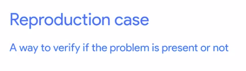

# Troubleshooting and Debugging Techniques

Google IT Automation with Python Course#4

## Welcome To The Course

Welcome to the course!
In this course, you’ll learn how to debug and troubleshoot a wide range of technical problems, both in your code and in someone elses code.

### Course prerequisites

This course requires some familiarity with basic IT concepts:

- **Operating systems**: `file systems`, `processes`, `log files`
- **Computer hardware**: `CPU`, `RAM`, `disk`, `graphic`, and `network cards`
- **Basic networking**: `network connections` and `network bandwidth`

The example scripts and programs in this course are written in `Python`, so you’ll need an understanding of this programming language, too.

🔗 [Stack Overflow Troubleshoot][stackoverflow]

### Introduction to Debugging

Whether it's an application crashing, a hardware issue, or network outage, as IT specialists, we tend to run into problems that need solving pretty regularly. When facing these issues, we need to make sure that people affected by the problem can get back to doing their jobs as fast as possible. We also have to plan for how to prevent against the same problems from happening again in the future. In this module, we'll learn some essential debugging techniques.

We'll keep applying them throughout the course as we explore different issues that can affect us or the users we're supporting in different ways. As with any other skills that you've learned throughout this program, the best way to get good at something is practice. So at the end of the module, you'll have the opportunity to apply these techniques and try solving a technical issue yourself on a virtual machine running Linux.

### What is Debugging

**Troubleshooting**:

![Troubleshoot][troubleshoot-definition]

**Debugging**:

![Debug-Definition][debug-definition]

We sometimes use troubleshooting and debugging interchangeably. But generally, we say troubleshooting when we're fixing problems in the system running the application, and debugging when we're fixing the bugs in the actual code of the application.

There are lots of tools that we can use to get more information about the system and what the programs in our system are doing. Tools like, `tcpdump` and `Wireshark` can show us `ongoing network connections`, and help us analyze the traffic going over our cables.

Tools like `ps, top, or free` can show us the number and types of resources used in the system. We can use a tool like `strace` to look at the system calls made by a program, or `ltrace` to look at the library calls made by the software.

**Debuggers**:

![Debug][debuggers]

> Both troubleshooting and debugging is an art

### Problem Solving Skills

There's a wide range of different technical problems that you might face as an IT specialist or systems administrator. But fortunately, there's a set of steps that you can usually take to solve almost any technical problem.

- The `first step is getting information`. This means gathering as much information as we need about the current state of things, what the issue is, when it happens, and what the consequences are, for example. To get this information, we can use any existing documentation that might help. This can be `internal documentation`, `manual pages`, or `even questions asked on the Internet`.

One super important resource to solve a problem is the `reproduction case`, `which is a clear description of how and when the problem appears`.

- The `second step is finding the root cause of the problem`. `This is usually the most difficult step`. Throughout this course, we'll discuss a lot of possibilities on how to get there. But the key here is to get to the bottom of what's going on, what triggered the problem, and how we can change that.
- The `final step is performing the necessary remediation`. Depending on the problem, this might include an immediate remediation to get the system back to health, and then a medium or long-term remediation to avoid the problem in the future. While these are three basic steps of problem-solving, they don't always happen sequentially. It's pretty common that while trying to find the root cause, we discover that we need even more info about the current state. So we gather more information until we find the answer we're looking for, or we could understand the problem just enough to create a workaround that lets our users get back to work quickly, but we'd still need more time to get to the root cause and prevent the problem from happening again. Preventing the problem from occurring can sometimes feel like a hassle, but it can actually save us and our users a lot of valuable time. This way we avoid having to solve the same problem over and over again.
- `Throughout the whole process, it's important that we document what we do`. We should note down the info that we get, the different things we tested to try, and figure out the root cause. Finally, the steps we took to fix the issue. This documentation might prove invaluable next time a similar issue pops up.

- Imagine a user asks you for your help because their computer is unexpectedly shutting down. Computers shouldn't shut down on their own, but the problem could be a hardware issue, a software issue, or even a configuration issue. So the first thing to do is to get more information. You'll want to know things like when it happened, what the user was doing when it happened, and how regularly it's happening. You'll also want to look at the computer logs to check if there are any interesting errors. If any aren't totally clear, you can look them up on the Internet to see what they mean. In our example, safe on a line in the logs that says the temperature threshold was exceeded and so the computer shutdown. That's useful information, you know why the computer shut down but you don't know why it overheated, so you'll need to keep investigating. After not finding anything else interesting in the logs, you decide to check if it's a hardware issue. When you open up the computer, you find that the fan that's supposed to cool down the CPU is full of dirt, and so it isn't spinning properly. That's the root cause of the problem. Now, the short-term remediation is to clean up the fan so that it can spin again and the computer doesn't overheat. But what's the long-term remediation? In this case, it would be deploying monitoring on the computers to make sure you get notified early when they're overheating. Long-term remediation would also include checking if you can reduce the amount of dust in the air so that there's less chance of this happening again.

### Silently Crashing Application

#### `strace` - trace system calls and signals

```sh
> ls
practice.py

> python3 practice.py
-- Assume practice.py has some internal error --

> strace python3 practice.py

execve("/usr/bin/python3", ["python3", "practice.py"], 0x7fff670025e8 /* 61 vars */) = 0
brk(NULL)                               = 0x1dc8000
arch_prctl(0x3001 /* ARCH_??? */, 0x7ffc796d5850) = -1 EINVAL (Invalid argument)
access("/etc/ld.so.preload", R_OK)      = -1 ENOENT (No such file or directory)

-----------------------------------So many system calls------------------------------------

read(3, "def hello(name):\n    print(\"hi \""..., 8192) = 80
read(3, "", 8192)                       = 0
close(3)                                = 0
write(2, "    hello()\n", 12    hello()
)           = 12
write(2, "TypeError: hello() missing 1 req"..., 66TypeError: hello() missing 1 required positional argument: 'name'
) = 66
sigaltstack(NULL, {ss_sp=0x1e0e5c0, ss_flags=0, ss_size=16384}) = 0
sigaltstack({ss_sp=NULL, ss_flags=SS_DISABLE, ss_size=0}, NULL) = 0
exit_group(1)                           = ?
+++ exited with 1 +++

> strace -o failure.strace python3 practice.py
> less failure.strace

read(3, "def hello(name):\n    print(\"hi \""..., 8192) = 80
read(3, "", 8192)                       = 0
close(3)                                = 0
write(2, "    hello()\n", 12    hello()


:/hello
Enter..... and find the errors.
```

`strace` command shows us all the `system calls` are program made. `System calls` are the calls that the programs running on our computer make to the running `kernel`. There are loads of different system calls and depending on what we're trying to debug.

#### Practice Quiz: Introduction to Debugging

**Question 1**:

What is part of the final step when problem solving?

- [ ] Documentation
- [x] Long-term remediation
- [ ] Finding the root cause
- [ ] Gathering information

**Question 2**:

Which tool can you use when debugging to look at library calls made by the software?

- [ ] top
- [ ] strace
- [ ] tcpdump
- [x] ltrace

**Question 3**:

What is the first step of problem solving?

- [ ] Prevention
- [x] Gathering information
- [ ] Long-term remediation
- [ ] Finding the root cause

**Question 4**:

What software tools are used to analyze network traffic to isolate problems? (Check all that apply)

- [x] tcpdump
- [x] wireshark
- [ ] strace
- [ ] top

**Question 5**:

The strace (in Linux) tool allows us to see all of the **\_** our program has made.

- [ ] Network traffic
- [ ] Disk writes
- [x] System calls
- [ ] Connection requests

### It Does Not Work

As we called out, the first step to solving a problem is getting enough information so that we can understand the current state of things. To do this we'll need to know what the actual issue we're solving is. This starts when we first come across the issue, which can be through report by a ticketing system or by encountering the problem ourselves. When working with users, it's pretty common to receive reports of failures that just boil down to, "It doesn't work." These reports usually don't include a lot of useful information but it's still important that the problem gets reported and solved. Which information is useful or not might depend on the problem. But there are some common questions that we can ask a user that simply report something doesn't work.

![It Does Not Work][idnw]

What were you trying to do? What steps did you follow? What was the expected result? What was the actual result? If the ticketing system your company uses allows this, it's a good idea to include these questions in the form that users have to fill out when reporting an issue. This way we save time and can start asking more specific questions right away.

### Creating a Reproduction Case



See log files in different OS


### Finding The Root Cause

When you first come across these concepts, it might seem that once you have a reproduction case, you already know the root cause of the problem. But more often than not, it's not true......

... we have a test server running the same websites. When we start the backup, we see that the website stop responding. This is great because we have re-production case, and we can debug it properly. How do we find the root cause?

One possible culprit could be too much disk input and output. To get more info on this, we could use `iotop`, which is a tool similar to top that lets us see which processes are using the most input and output. Other related tools are `iostat` and `vmstat`, these tools show statistics on the input/output operations and the virtual memory operations. If the issue is that the process generates too much input or output, we could use a command like `ionice` to make our backup system reduce its priority to access the disk and let the web services use it too.

What if the input and output is not the issue? Another option would be that the service is using too much network because it's transmitting the data to be backed up to a central server and that transmission blocks everything else. We can check this using `iftop`, yet another tool similar to top that shows the current traffic on the network interfaces. If the backup is eating all the network bandwidth, we could look at the documentation for the backup software and check if it already includes an option to limit the bandwidth. The `rsync` command, which is often used for backing up data, includes a `-bwlimit`, just for this purpose. If that option isn't available, we can use a program like `Trickle` to limit the bandwidth being used.

But what if the network isn't the issue either? Remember, we need to put our debugging creativity to work, and come up with other possible reasons for why it's failing. Another option could be that the compression algorithms selected is too aggressive, and `compressing the backups` is using all of the server's processing power. We could solve this by reducing the compression level or using the `nice` command to reduce the priority of the process and accessing the CPU.

If that's still not the case, we need to keep looking, check the logs to see if we find anything that we missed before. Maybe look online for other people dealing with similar problems related to interactions of the backing up software with the web surfing software, and keep doing this until we come up with something that could be causing our problem. I know this sounds like a lot of work, but it's usually not that bad. In general, by using the tools available to us, we can find enough info to land on the right hypothesis after only a few tries and with experience, we'll get better at picking up the most likely hypothesis the first time around. Up next, we'll talk about a tricky type of technical problem that we all have to face, intermittent issues.

### Practice Quiz: Understanding the Problem

**Question 1**:

When a user reports that an "application doesn't work," what is an appropriate follow-up question to gather more information about the problem?

- [ ] Is the server plugged in?
- [ ] Why do you need the application?
- [ ] Do you have a support ticket number?
- [X] What should happen when you open the app?

**Question 2**:

What is a heisenbug?

- [X] The observer effect.
- [ ] A test environment.
- [ ] The root cause.
- [ ] An event viewer.

**Question 3**:

The compare_strings function is supposed to compare just the alphanumeric content of two strings, ignoring upper vs lower case and punctuation. But something is not working. Fill in the code to try to find the problems, then fix the problems.

```py
import re

def compare_strings(string1, string2):
    # Convert both strings to lowercase
    # and remove leading and trailing blanks
    string1 = string1.lower().strip()
    string2 = string2.lower().strip()


    # Ignore punctuation
    # punctuation = r"[.?!,;:-']"

    # Error: ':-' Here is the problem. Did you get it?
    # Fixed ...
    punctuation = r"[.?!-,;:']"
    string1 = re.sub(punctuation, r"", string1)
    string2 = re.sub(punctuation, r"", string2)

    # DEBUG CODE GOES HERE

    return string1 == string2


print(compare_strings("Have a Great Day!", "Have a great day?"))  # True
print(compare_strings("It's raining again.", "its raining, again"))  # True
print(compare_strings("Learn to count: 1, 2, 3.",
                      "Learn to count: one, two, three."))  # False
print(compare_strings("They found some body.", "They found somebody."))  # False
```

**Question 4**:

How do we verify if a problem is still persisting or not?

- [ ] Restart the device or server hardware
- [X] Attempt to trigger the problem again by following the steps of our reproduction case
- [ ] Repeatedly ask the user
- [ ] Check again later

**Question 5**:

The datetime module supplies classes for manipulating dates and times, and contains many types, objects, and methods. You've seen some of them used in the dow function, which returns the day of the week for a specific date. We'll use them again in the next_date function, which takes the date_string parameter in the format of "year-month-day", and uses the add_year function to calculate the next year that this date will occur (it's 4 years later for the 29th of February during Leap Year, and 1 year later for all other dates). Then it returns the value in the same format as it receives the date: "year-month-day".

Can you find the error in the code? Is it in the next_date function or the add_year function? How can you determine if the add_year function returns what it's supposed to? Add debug lines as necessary to find the problems, then fix the code to work as indicated above.

```py
import datetime
from datetime import date


def add_year(date_obj):
    try:
        new_date_obj = date_obj.replace(year=date_obj.year + 1)
    except ValueError:
        # This gets executed when the above method fails,
        # which means that we're making a Leap Year calculation
        new_date_obj = date_obj.replace(year=date_obj.year + 4)
    return new_date_obj


def next_date(date_string):
    # Convert the argument from string to date object
    date_obj = datetime.datetime.strptime(date_string, r"%Y-%m-%d")
    next_date_obj = add_year(date_obj)

    # Convert the datetime object to string,
    # in the format of "yyyy-mm-dd"
    # next_date_string = next_date_obj.strftime("yyyy-mm-dd")
    # Here (yyyy-mm-dd) is the problem. Did you get it?
    next_date_string = next_date_obj.strftime("%Y-%m-%d")
    return next_date_string


today = date.today()  # Get today's date
print(next_date(str(today)))
# Should return a year from today, unless today is Leap Day

print(next_date("2021-01-01"))  # Should return 2022-01-01
print(next_date("2020-02-29"))  # Should return 2024-02-29
```


<!-- urls and file paths -->

[stackoverflow]: https://stackoverflow.com/search?q=troubleshoot
[troubleshoot-definition]: ./images/troubleshoot-definition.png
[debug-definition]: ./images/debug-definition.png
[debuggers]: ./images/debuggers.png
[idnw]: ./images/it-doesnot-work.png
