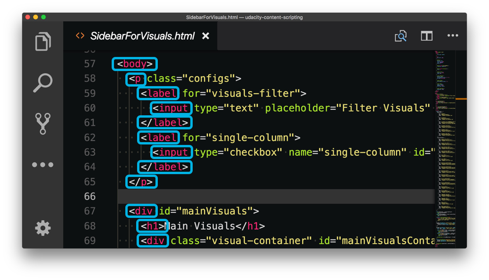
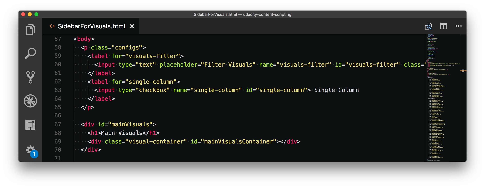
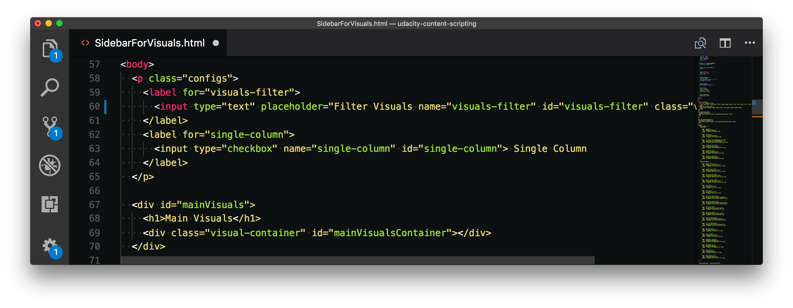

# What is Programming

- [What is Programming](#what-is-programming)
  - [Web Development Language](#web-development-language)
    - [Lesson 1: Introduction](#lesson-1-introduction)
    - [Front End vs Back End](#front-end-vs-back-end)
    - [Front End Languages](#front-end-languages)
    - [Back-End Languages](#back-end-languages)
  - [Programming](#programming)
    - [Syntax](#syntax)
    - [Text Editors](#text-editors)
    - [PROGRAMMING](#programming-1)
    - [Estimate Time to Complete](#estimate-time-to-complete)
  - [Standards](#standards)
    - [Developing HTML & CSS](#developing-html--css)
    - [Developing JavaScript](#developing-javascript)
    - [Developing Python](#developing-python)

## Web Development Language

### Lesson 1: Introduction

Hello and welcome to this course on learning "What is Programming"! In this course, we're going to be looking at words, terms, and concepts in the worlds of web technology and programming. This course isn't going to dive into the nitty gritty details of how a web request is converted to bits and sent across the wire as electrical pulses...and that level of detail of explanation is already significantly more complicated and low-level than we'll be diving!

In this course, we'll be looking at five main sections:

- Web Languages
- Programming
- Standards
- Version Control
- Disparate Web Terms

**Web Languages**:

The web is a wide and varied place. Many people spend their entire careers in the world of web development. So in this section, we'll be looking at:

- front end vs back end
- Front-end languages
- Back-end languages

**Programming**:

The notion of "programming" can be a little cryptic if you haven't ever done it before. What exactly does a programmer _do_? How does one become a programmer? In this section, we'll look at:

- Syntax
- Text Editors
- Programming
- Estimating how long it takes to "program"

**Standards**:

Where do programming languages come from? How are they developed? What in the world is a "spec"? We'll look at these questions and others in the following topics:

- How HTML and CSS are developed
- How JavaScript is developed
- How Python is developed

**Version Control**:

Version Control is incredibly powerful and is used by any programmer that's worth their weight. In the following sections, we'll look at what Version control is, how it works, and other parts of the version control ecosystem. The topics in this section are:

- Why Version Control is needed
- How Version Control works
- Where GitHub fits
- What a PR is
  
**Disparate Web Terms**:

The web is a huge place, and not everything fits neatly into the "front end" or the "back end". There are terms that span both or terms that are tangentially related. In this section on "Disparate Web Terms", we'll be looking at terms and concepts that are in the world of web development but don't fit cleanly in "front end", "back end", or "version control". The topics in this section are:

- Web Requests
- Debugging
- Databases and APIs
- Markdown vs Markup
- Libraries and Frameworks
- CMS
- Command Line

### Front End vs Back End

[](https://www.youtube.com/watch?v=BiSNb2queic)

We just looked at a number if important terms in this video, so let's go over them a bit more. We looked at:

- the client
- a server
- the front end
- the back end
- and full stack

When a developer uses the word "client", they could mean the person that's making a request but, more commonly, "client" is used to refer to the user's browser. Now, in contrast to the "client", there's the "server". A server is just a computer that's waiting to provide information. There's nothing really special about a server. It's just a computer with specific software installed on it. With the right software, you could turn your computer into a server.

Front end, front-end languages, and front-end development...all of this takes place on the client/browser. The front-end languages are:

- HTML
- CSS
- JavaScript

So a front-end developer is someone that's working with HTML, CSS, and JavaScript files to build what users see on the client (in their browser).

Back end, back-end languages, and back-end development...all of these take place on the server. There are actually many back-end languages, so we'll look at them more in the Back-end Languages section.

Now, if a developer is working on the front end and the backend, then they are what's known as a full-stack developer.

### Front End Languages

[](https://www.youtube.com/watch?v=y3Susu1gDD4)

**Programming**:

There are many definitions of what "programming" is. Some are helpful, while others end up being pretty cryptic. Let's define "programming" as:

> a tool (written instructions) you use to tell the computer what to do

There are a number of requirements that make up programming language, but we'll limit them to just a few. A programming language needs to have:

- data
- data structures
- flow control

For a programming language to work, it must keep track of data (information). Think of any website you've ever interacted with, it stores information and presents it to you in some way. A programming language is (or more likely multiple programming languages are) responsible for presenting this data to you.

A programming language must have its own means of storing that data internally. The different ways it can store/represent this data internally are called data structures. Data structure is a abstract-y sounding word, but you're probably familiar with many of types of data structures that make up a programming language:

- string - just plain characters of text wrapped in quotes (e.g. `"Richard"`, `'Udacity'`, `"Supercalifragilisticexpialidocious"`)
- number - literally just numbers (e.g `1`, `0`, `117`)
- array or list - a list of items (e.g. an array of numbers: `[1, 3, 9]`, a list of strings: `['Richard', 'Udacity', 'one', 'apple', 'ice cream']`)
- object or dictionary - a key/value pair (e.g. `{firstName: 'Richard'}`)

A programming language must be able to perform actions based off of some information or event. For example, here are some flow control structures that most programming languages have:

- `if` - perform some action _if_ something else is true
  - if the jar is not full, add one piece of candy to the jar
- `if / else` - perform some action _if something is true, otherwise (else) perform a different action
  - if the jar is full, empty it out
  - otherwise (else!), add another piece of candy to the jar
- while - keep doing an action while
  - while the jar is not full, add one new piece of candy to the jar every second

Now that we've looked at what makes up a programming language, let's look at the front-end languages.

**Front-end Languages**:

We already saw that the front-end languages are HTML, CSS, and JavaScript. I like to think of these being the three main sections that make up a website:

- HTML = the structure of the website
- CSS = how the website looks
- JavaScript = how the website functions

**HTML**:

HTML stands for "HyperText Markup Language". HTML is not a programming language. Instead, it's a markup language. Markup is just text that's been marked up with special characters. In HTML, some of the marked up pieces of text are called **tags**.



**CSS**:

CSS stands for "Cascading Style Sheet". CSS is also not a programming language. CSS is a set of rules that specify how the HTML tags should be displayed.

Here is a CSS rule:

```cs
h1 {
    text-align: center;
}
```

The CSS here is telling the `h1` HTML tag that it should display its text aligned to the center (as opposed to being left aligned or right aligned).

**JavaScript**:

JavaScript is what controls the functionality of a website. Since it _is_ a programming language, it can do so many things! For example, if a popup window appears, that's JavaScript. If you fill out a form but enter something incorrectly and the form changes color and displays an error message...that's JavaScript!

> Capital S
> One thing to note, the capital S in "JavaScript" isn't a mistake!

I said it before, but JavaScript _is_ a programming language. Because it is, that means that JavaScript has all of the things we looked at earlier in the section on what makes up a programming language.

JavaScript:

- controls data
- has different data structures
  - number
  - string
  - array
  - object
- flow control
  - if
  - while

**Udacity Content**:

If you're interested in learning more about front-end languages and front-end development, check out:

the [Front End Nanodegree Program][1]
the [Intro to HTML and CSS course][2]
the [Intro to JavaScript course][3]

**Further Research**:

To dig into front-end technology a bit more, some other good resources would be the Mozilla Developer Network (commonly abbreviated to just "MDN"):

- the [HTML guide][4] on MDN
- the [CSS guide][5] on MDN
- the [JavaScript guide][6] on MDN

### Back-End Languages

Many Back-end Languages
There are only three front-end languages (HTML, CSS, and JavaScript), but there are maaaaany back-end languages!

- Python
- PHP
- Ruby
- JavaScript
- Go
- Java
- C++
- C#
...and the list keeps going!

> Udacity Teaches Python
> The [Full Stack Nanodegree Program][7] covers python. So if you're interested in learning it, check out that link!

**Purpose of a back-end language**:

A back-end language can do many, many things, but some of the main responsibilities are:

- to process data
- determine what files/content to send to the front end
- build up the HTML, CSS, and JavaScript files

Both front-end programming languages and back-end programming languages can do data processing. When a front-end programming language does data processing it's using the client's (or more clearly, the user's) computer to do the processing. While when a back-end programming language does data processing, the server is doing it. Typically, a server is going to be much more powerful, and therefore faster than the average person's personal computer.

Once all of the data has been processed, the back-end language will build up the HTML, CSS, and JavaScript files with the content they need. And then it will send these files to the client to be displayed.

**All Together Now**:

So we looked at front-end languages, and now we've just looked at back-end languages. These are the pieces we have so far, so let's put them together:

- a user types in a website in their browser
- the client (the browser) sends out a request for the website
- the server receives that request
- the back-end language (e.g. Python) determines what data and files to send back
- the server sends a response to the client with the data and all of the website files
- the client constructs the website by looking at the structure of the HTML file, styling from the CSS file(s), and functionality provided by the JavaScript file(s)

**Udacity Content**:

If you're interested in learning more about back-end languages and back-end development, check out:

- the [Full Stack Nanodegree] Program
- the [Programming Foundations with Python] course

**Further Research**:

To dig into back-end technology a bit more, check out the following resources:

- <https://www.python.org/>
- <https://www.ruby-lang.org/en/>
- <http://www.php.net/>
- <https://nodejs.org/en/>
- <https://golang.org/>

## Programming

### Syntax

**Syntax Highlighting Code**:

A program that's built for editing code will automatically highlight different parts of the code. This is called **syntax highlighting**.



Screenshot of code editor with code displayed with syntax highlighting.
The code is colored to help the user to see similar areas and to navigate around the code more easily.

**Syntax Errors**:

One of the types of problems that can occur in code is if the developer makes a mistake in writing the syntax of the language. A mistake like this causes a **syntax error**. In a code editor, this will show up in various ways. One of the main ways, though, is that the syntax highlighting will display incorrectly (which is an indication to the developer that there's some kind of problem).

A few examples of syntax errors would be:

- a quote is missing
- a comma is used instead of a semicolon
- a curly brace (i.e. `{`) is used instead of a bracket (i.e. `[`)
  
Here's the code from the image above, but this time there's a syntax error in it:



Screenshot of code editor with code displayed with broken syntax highlighting.
The syntax highlighting is messed up because the code was written incorrectly (a syntax error).

**Further Research**:

To learn more about syntax and syntax highlighting, check out these resources:

[Syntax highlighting](https://en.wikipedia.org/wiki/Syntax_highlighting)
[Syntax error](https://en.wikipedia.org/wiki/Syntax_error)

### Text Editors

Code in Text Editors for Coding purpose(like vscode, atom, sublime)

```html
<body>
  <p class="configs">
    <label for="visuals-filter">
      <input type="text" name="visuals-filter" id="visuals-filter" class="visuals-filter">
    </label>
    <label for="single-column">
      <input type="checkbox" name="single-column" id="single-column"> Single Column
    </label>
  </p>
```

Code in normal text editors: like (google-docs, ms-office)

```doc
<body>
<p class="configs">
<label for="visuals-filter">
<input type="text" name="visuals-filter" id="visuals-filter" class="visuals-filter">
</label>
<label for="single-column">
<input type="checkbox" name="single-column" id="single-column"> Single Column
</label>
</p>
```

**Popular Text Editors**:

There are many different text editors that are available. A lot are free, while some are for pay. A major part of picking a text editor is how much the developer likes it, likes the features it offers, etc. A developer doesn't pick one text editor and stick with it for life. They'll try one out...maybe use it for a month or two...and then switch to a different one. If they find one they like, they could stick with it for several years, though.

Currently, these are the top three code editors that I recommend right now:

- [VSCode](https://code.visualstudio.com/)
- [Atom](https://atom.io/)
- [Sublime Text](https://www.sublimetext.com/)

Text editors are always being developed and improved, though, so this list of the "top 3" will probably change.

Personally, the code editor that _I_ m using right now is `VSCode`.

**Text Editor Themes**:

There are zillions of themes out there, so if you're not happy with the set of default themes that come with your text editor, pick a new one!

link to themes for

- [VSCode Themes](https://code.visualstudio.com/docs/getstarted/themes)
- [Atom Themes](https://atom.io/themes)
- [Sublime Text Themes](https://packagecontrol.io/browse/labels/theme)

### PROGRAMMING

**Programming**:

Programming. What does that mean? What does a programmer actually _do_ for hours upon hours every day?

Programming is literally just writing code. That's it. There's no fancy magic involved. So if it's a front-end developer, they would probably have several HTML files open, several CSS files open, and several JavaScript files open in their code editor. Programming, then, is just writing HTML in the HTML file(s) and/or writing CSS in the CSS file(s) and/or writing JavaScript in the JavaScript file(s).

**Fixing Errors**:

In the previous section on Syntax, we looked at syntax errors. Part of a programmer's responsibilities is to write code that is free from errors. A developer isn't perfect, though, so they will make mistakes. When these errors occur, the developer most stop and fix them.

This finding the error(s) and then re-writing the code so it's now error-free is also part of programming.

**Refactoring**:

Refactoring is taking code that achieves outcome X and either deleting or rewriting it (so there's less code) that still achieves outcome X.

Refactoring seems a bit odd if you haven't ever written code before, but after weeks, months or years of working on a project, there's a lot of code that's been built up. For various reasons, some of that code might not even be used anymore. By removing code (that doesn't affect the overall functionality), it makes the project easier to work with and easier to understand what's happening (because there's less code to read through).

Refactoring is also a part of programming.

### Estimate Time to Complete

Programming can be a challenging profession in that actually programming is a journey of discovery.

When a programmer starts working on something, they don't just sit down, open up an empty file, and code everything perfectly from start to finish. Things come up that stop the developer from proceeding. There could be a syntax error that they have to stop and fix, or a bigger problem that needs resolving, or perhaps the code functions correctly, but doesn't do what the developer expected it to do. In this last case, the code is written accurately, but the logic is incorrect (meaning the ordered set of steps that the code follows doesn't do what the developer thought it would). All of these things require the developer to stop and address them.

As you can see, there's a lot of trial and error in getting to the end result. Now, the more senior a developer is, the fewer mistakes they make and/or the faster they are able to diagnose and resolve the issues. But even an expert will encounter issues that will take them some time to resolve.

But these issues are a large part of becoming an expert! You learn a lot more from your mistakes than you do from your successes!

## Standards

### Developing HTML & CSS

[](https://www.youtube.com/watch?v=QmllknZw8C4)

**HTML & CSS Code**:

Here's some HTML code:

```html
<p class="configs">
    <label for="visuals-filter">
        <input type="text" name="visuals-filter" id="visuals-filter" class="visuals-filter">
    </label>
    <label for="single-column">
        <input type="checkbox" name="single-column" id="single-column"> Single Column
    </label>
</p>
```

How did we get these tags? Why is a label tag written as `<label>`? What about the `for` attribute? Why is the word "for"?

What about this CSS code:

```css
.configs {
    display: flex;
    font-size: 0.7em;
    color: #bdbdbd;
    margin: 0;
}
```

How did _I_ know how to write these rules? How did I know what was available to me? How did I know it was `font-size` and not `font size`, `fontsize` or `font_size`?

**W3C**:

The organization that determines the HTML and CSS languages is the W3C. "W3C" stands for the World Wide Web Consortium.

The W3C is made up of different different groups that work on the different languages. You can find out more information about the W3C on their website: <https://www.w3.org/>

**Specs**:

These groups create `a specification file` for each language

Here are some specifications:

- the [HTML 5.3](https://www.w3.org/TR/html53/) spec
- the [HTML 5.2](https://www.w3.org/TR/html52/) spec
- the [CSS Grid Layout](https://www.w3.org/TR/css-grid-1/) Module Level 1 spec
- the [CSS Transitions](https://www.w3.org/TR/css-transitions-1/) spec

These spec files detail out exactly how these parts of the language should work. So a spec file is the standard. Then browser makers refer to these specifications when they're building out the functionality for their browser.

### Developing JavaScript

[](https://www.youtube.com/watch?v=rO_tcfbrPVc)

**JavaScript Code**:

Here's some JavaScript code:

```java
function atomIsVideoType(table) {
  const validVideoTypes = ['HS', 'SC', 'A', 'HS/SC', 'HS/A', 'SC/A', 'HS/SC/A'];
  const tableType = getTableType(table);

    if (validVideoTypes.indexOf(tableType) >= 0) {
        return true;
    }

    return false;
}
```

How did we get the `if`? Or what about the word `function`?...where did it come from? Or the cryptic `const` keyword?...how does it function?

**TC39**:

The organization that's in charge of the development of the JavaScript programming language is ECMA International. ECMA International is made up of different groups called "technical committees". The technical committee that's in charge of JavaScript is the 39th committee (commonly displayed as TC39).

JavaScript is actually one implementation of a language specification called ECMAScript.

**The Spec**:

The actual specification for the ECMAScript language specification is [ECMA-262](https://www.ecma-international.org/publications/standards/Ecma-262.htm).

**Udacity Content**:

The ECMAScript specification can definitely be a bit cryptic to read, especially if you're brand new to the language. If you're interested in learning a little bit more about how to use the language before diving into the language's spec, then why don't you take a look at:

- the [Front End Nanodegree](https://www.udacity.com/course/front-end-web-developer-nanodegree--nd0011) Program
- the [Intro to JavaScript course](https://www.udacity.com/course/intro-to-javascript--ud803)
- the [JavaScript and the DOM course](https://www.udacity.com/course/javascript-and-the-dom--ud117)
- the [Object-Oriented JavaScript course](https://www.udacity.com/course/object-oriented-javascript--ud711)

**Further Research**:

How to Read the [ECMAScript Specification](https://www.ecma-international.org/ecma-262/11.0/index.html#title)

### Developing Python

[](https://www.youtube.com/watch?v=2OWZLRmeAo4)

**Python Code**:

Here's some Python code:

```py
def answer(s):
    encryption = {'a': 'z', 'b': 'y', 'c': 'x', 'd': 'w', 'e': 'v', 'f': 'u', 'g': 't', 'h': 's', 'i': 'r', 'j': 'q', 'k': 'p', 'l': 'o', 'm': 'n', 'n': 'm', 'o': 'l', 'p': 'k', 'q': 'j', 'r': 'i', 's': 'h', 't': 'g', 'u': 'f', 'v': 'e', 'w': 'd', 'x': 'c', 'y': 'b', 'z': 'a'}
    decrypted_word = ''

    for c in s:
        if c in string.ascii_lowercase:
            decrypted_word += encryption[c]
        else:
            decrypted_word += c

    print decrypted_word
```

How did we get the `def`? In the JavaScript language, the curly brace (i.e. `{`) is used after an `else`, `while` in Python, it's the colon (i.e. `:`)...how was it determined that Python would use the `colon` instead of the `curly brace`?

**PSF**:

The Python Software Foundation (PSF) is the standards body for the Python language. This group determines how the Python language is built and improved. Here's the PSF website - <https://www.python.org/psf-landing/> .

The documentation for using the current version of the Python language can be found here - <https://docs.python.org/3/> .

Udacity Content
Typically, back-end languages have better documentation, because the language maintainers just have to create the language and explain how to use it. Compare this with front-end language maintainers that don't build the websites that have to use HTML, CSS, and JavaScript...so front-end language maintainers develop the specs that are then used by browser makers when they are building out their browser.

If you'd like to learn more about Python, check out the [Python docs](https://docs.python.org/3/) or take a look at one of the following Udacity resources:

the [Full Stack Nanodegree Program][7]
the [Programming Foundations with Python][8] course

<!-- urls/paths -->
[1]: https://www.udacity.com/course/front-end-web-developer-nanodegree--nd0011
[2]: https://www.udacity.com/course/intro-to-html-and-css--ud001
[3]: https://www.udacity.com/course/intro-to-javascript--ud803
[4]: https://developer.mozilla.org/en-US/docs/Web/HTML
[5]: https://developer.mozilla.org/en-US/docs/Web/CSS
[6]: https://developer.mozilla.org/en-US/docs/Web/JavaScript
[7]: https://www.udacity.com/course/full-stack-web-developer-nanodegree--nd0044
[8]: https://www.udacity.com/course/introduction-to-python--ud1110
